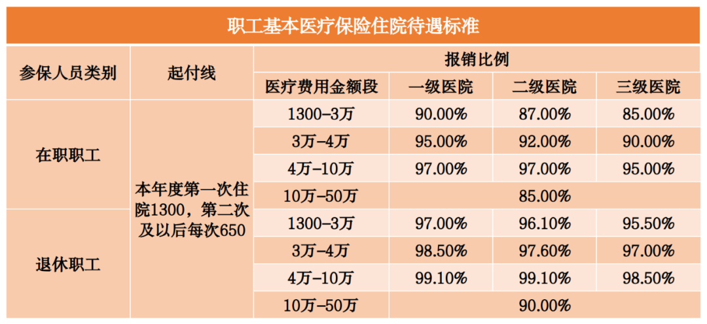
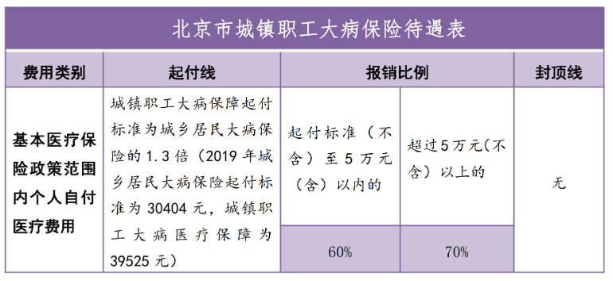

目前，北京市基本医疗保险制度包括两种类型，即：城镇职工基本医疗保险制度（简称城镇职工医保）和城乡居民基本医疗保险制度（简称城乡居民医保），两项基本医疗保险制度覆盖了北京市全体城镇职工和城乡居民。

基本医疗保险待遇包括：门（急）诊待遇和住院类待遇，两者分别设置了起付标准、支付比例、最高支付限额。

（一）起付标准

起付标准也称“起付线”，是指参保人员在享受医疗费用报销之前需要自己先行支付的费用额度。

（二）支付比例

支付比例是指起付标准以上至最高支付限额以下，医保基金对参保人员医疗费用的报销比例。

（三）最高支付限额

最高支付限额也称“封顶线”，是指基本医疗保险基金支付参保人员医疗费用的上限。超出最高支付限额以上的医疗费用，基本医疗保险基金不再支付。

### 北京市城镇职工基本医疗保险待遇

目前，本市在职职工医院门（急）诊报销比例达到70%，退休人员达到85%，社区卫生机构报销比例均为90%，门诊报销2万元以上，再发生医疗费用，在职职工报销60%、退休人员报销80%，上不封顶。

本市在职职工住院报销比例在85%以上，退休人员住院报销比例在90%以上，最高可达99.1%，住院封顶线为50万元。

### 北京市城乡居民基本医疗保险待遇

目前，城乡居民参保人员的门（急）诊封顶线5000元，住院封顶线为25万元。

注：①上表住院起付线特指本年度首次住院，老年人和劳动年龄内居民本年度第二次及以后住院，起付线减半。

②学生儿童的住院起付线均减半。

③区属三级定点医院住院报销比例为78%。

------

## 北京医保二次报销

北京市医疗保障局、北京市财政局联合印发《关于进一步加强城镇职工大病医疗保障的通知》(京医保发〔2020〕20号)，自2020年1月1日起执行，建立城镇职工大病医疗保障机制。

01

二次医保报销是否需要申请？

不需要，参保人员无需申报。

02

城镇职工二次报销标准

城镇职工大病保险起付线为城乡居民大病保险起付线的1.3倍。

起付线(不含)以上符合大病医疗保障报销范围的个人自付医疗费用，实行分段累计报销。其中：

✅5万元(含)以内部分，由城镇职工大额医疗互助资金支付60%；

✅5万元(不含)以上部分，由城镇职工大额医疗互助资金支付70%，上不封顶。

03

城乡居民二次报销标准

城乡居民大病保险起付线为上一年度本市城镇居民中20%低收入户人均可支配收入。

起付线以上（不含）部分，采取分段报销：

✅累计5万元（含）以内的个人自付医疗费用，大病保险基金报销60%；

✅超过5万元（不含）以上的个人自付医疗费用，大病保险基金报销70%。大病保险无封顶线，报销上不封顶。

04

特别说明

北京市政策规定，低保、低收入、特困等困难群体参保人员的大病保险起付线减半，各费用段大病保险报销比例分别提高5个百分点，上不封顶。

# 北京医保报销常见问题解答

（一）哪些情况的医疗费用不纳入医保基金支付范围？

根据《中华人民共和国社会保险法》相关规定，下列医疗费用不纳入基本医疗保险基金支付范围：（1）应当从工伤保险基金中支付的；（2）应当由第三人负担的；（3）应当由公共卫生负担的；（4）在境外及港澳台地区就医的。

（二）医保报销对住院天数有限制和要求吗？

住院天数是由医生根据病人病情需要及医院相关管理规定确定的，医保部门对住院天数没有限制。参保人员住院期间发生的医保政策范围内费用，医保按规定予以报销。

（三）住院期间持社保卡在其他定点医院就诊并产生的门诊费用能否报销？

不能。根据《关于实施社会保障卡医疗费用实时结算有关问题的通知》（京人社办发〔2009〕13号）规定：参保人员在住院期间发生的门诊医疗费用，医疗保险基金不予支付。

（四）医保基金支付急救车车费吗？

根据《关于印发北京市基本医疗保险服务设施范围管理暂行办法的通知》规定，基本医疗保险基金不予支付急救车车费。