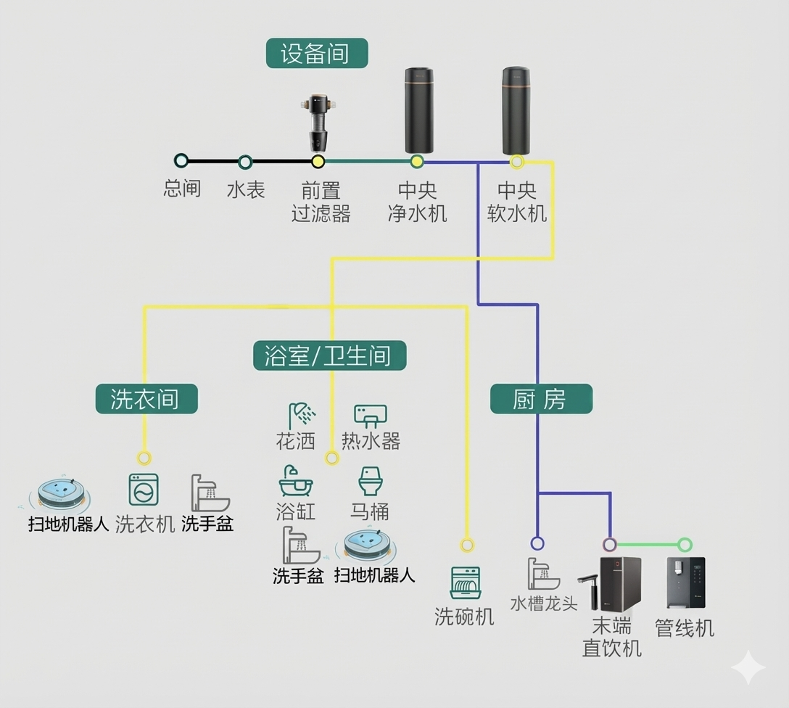
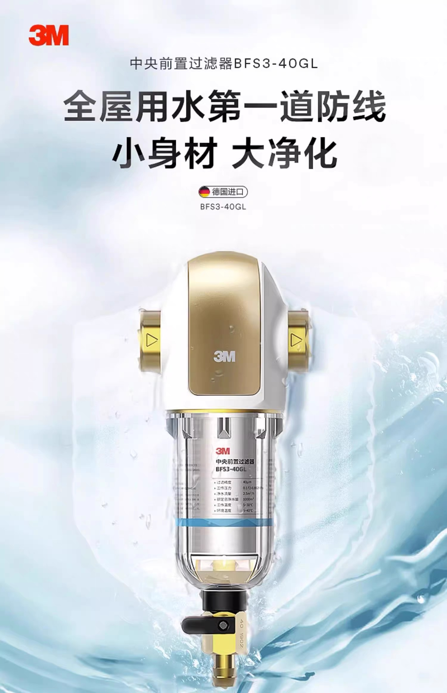
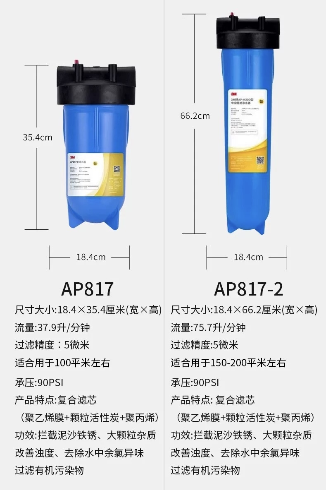
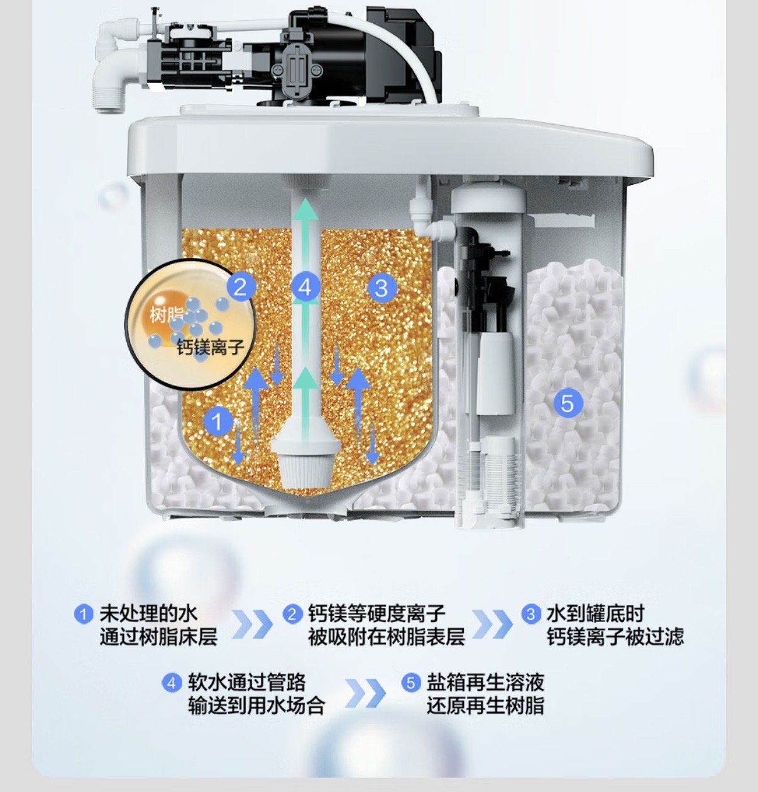
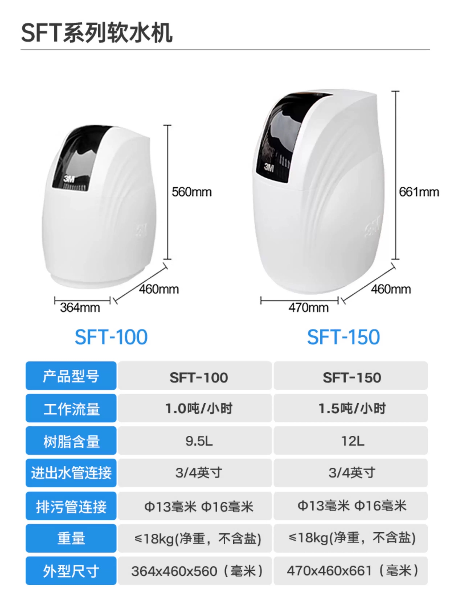
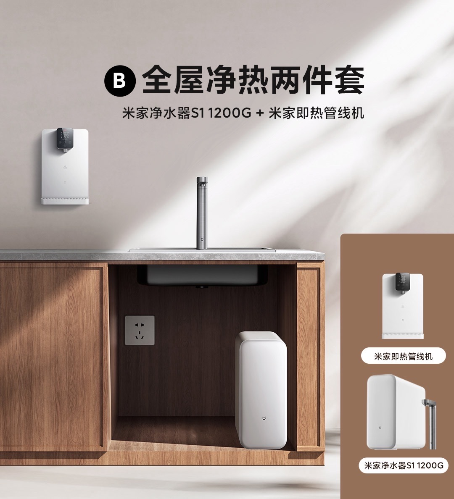
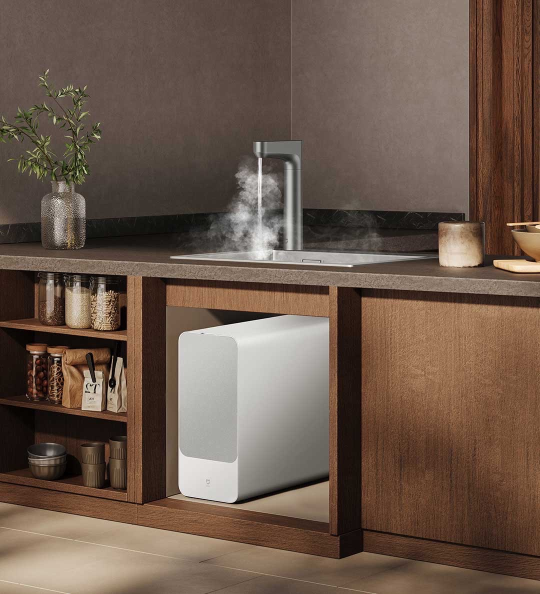

为了在复杂的用水环境下保障家人的生活品，家庭净水成为了必选项。净水主要有三方面的需求：一是日常饮水干净（直饮水）；二是对家电的保护（软水）；三是全屋用水的清洁（粗滤的净水）。这三个需求互相独立，可以根据自来水品质和自己的喜好选择。

## 整体构造

## 1. 前置过滤器（第一道防线：粗滤）

前置过滤器可以直接接入入户水管，对全屋的水源进行粗过滤。它的过滤精度不高（40微米，1微米等于0.001毫米），用于过滤泥沙、铁锈、虫卵等大颗粒物质，因此不会影响水压/水流速度。它是全屋净水的“排头兵”，主要作用是保护后面的净水器、花洒和水龙头不被堵塞。

**成本：**百元以内。无需用电、无须更换滤芯，后期维护成本几乎为零。使用期间，每个月冲洗即可（部分产品带自动冲洗功能）。所谓的冲洗就是打开过滤器的排水管路，让自来水直接冲入滤芯并排走。下图的3M前置过滤器，左进右出，底部是冲洗口、直接接入下水管，平时常闭，冲洗时打开。

## 2. **中央净水机**（可选：利用活性炭吸附异味和余氯）

如果所在的地区自来水**异味较重**，或者特别在意自来水中的**余氯（漂白粉味）**，在“前置过滤器”之后，建议加装一个**中央净水机**（利用活性炭吸附异味和余氯），这样洗脸、刷牙时也不会闻到异味。中央净水器也是前置过滤器的一种，直接安装在入户水管，它的过滤精度约为5微米，虽然达不到直接饮用标准，但是可以为全屋用水提供更舒适的体验。

因为过滤精度的提升，选择中央净水机需要考虑通量的问题，大户型/别墅需要选择更高流量的设备，下面是3M AP812型号过滤器的对比。

**成本：**千元以内。无需用电、**需要**更换滤芯，后期维护百元/年。

## 3. 中央软水机（生活享受：软化）

硬水是指含有较多可溶性钙镁离子（如碳酸钙和碳酸镁）的水，通常以1升水中碳酸钙的毫克数（mg/L）来衡量，< 120 mg/L为软水，≥ 120 mg/L为硬水。国家对自来水厂的供水标准是＜500mg/L。一般来说，我国南方多为软水，北方地区多为硬水。硬水的危害主要体现在影响生活用品使用和家电效率，对健康有潜在影响，如增加皮肤干燥、降低洗涤剂效能、加速衣物老化变硬，并易在管道和电器中形成水垢，影响热水器等设备性能，长期可能与肾结石、心血管疾病有关，但也有观点认为硬水补充了钙镁元素，对健康无大害。

上节介绍的前置净水器、中央净水器的过滤精度不够，5微米的孔径远大于钙镁离子，无法阻挡它们。因此就需要软水机，软水机的功能通过树脂交换去除水中的钙、镁离子，能够有效预防花洒结垢、保护洗碗机等电器、让洗后的衣服更蓬松、皮肤不紧绷。

目前市面上主流的家用软水机，核心原理都是离子交换技术。

- **吸附过程：**软水机内部装满了微小的离子交换树脂（通常是带负电荷的球状颗粒），这些树脂预先吸附了钠离子 。
- **置换过程：**当含有钙和镁的硬水流经树脂层时，由于树脂对钙、镁离子的吸引力更强，钙、镁离子会“挤掉”树脂上的钠离子并附着在上面，而钠离子则进入水中。
- **再生循环**：当树脂上的钠离子被消耗殆尽（吸满了钙镁）后，软水机会自动进入“再生”模式。此时，系统会抽取盐箱中的浓盐水冲洗树脂，利用高浓度的钠离子强行把钙、镁离子替换下来并排出机外，使树脂恢复软化能力。

因此软水中含有较高的钠离子，不推荐直接饮用，因此软水机通常接入厕所、浴室、洗碗机、洗衣机、热水器等水路的前端。不接入厨房、直饮机等水路。

软水机同样要考虑水通量的问题，根据自家户型和人口选择。下面是3M软水机的对比：

**成本：**设备5K元左右。需用电、需要持续补充软水盐。软水盐成本百元/年。

## 4. 具备RO反渗透净水机（可饮用纯净水）

RO膜是指通过 0.0001 微米的孔径，彻底滤除重金属、细菌、抗生素及各种异味（如杭州事件中的硫醚物质），RO反渗透净水机也具备去除钙、镁离子的作用。 这是解决“喝水”问题的终极方案，出水可直接生饮。

**因为过滤精度极高，因此水流速/通量较低。**因此流速是较为关键的指标， 建议选择 1000G 以上（2.65升/分钟），接水速度相对快。

如果考虑加热功能，可以在净水机后接入“管线机”，如下图：

当然也可以选择带即热功能的净水机，例如小米Q1000，支持热水直出、无陈水。

成本：根据功能不同，设备1K-5K元左右，需要用电、2-5年更换滤芯，3年之后滤芯成本约百元/年。同时，净水过程会产生废水。

