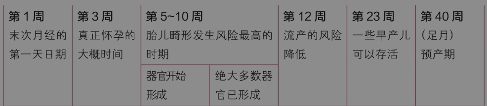
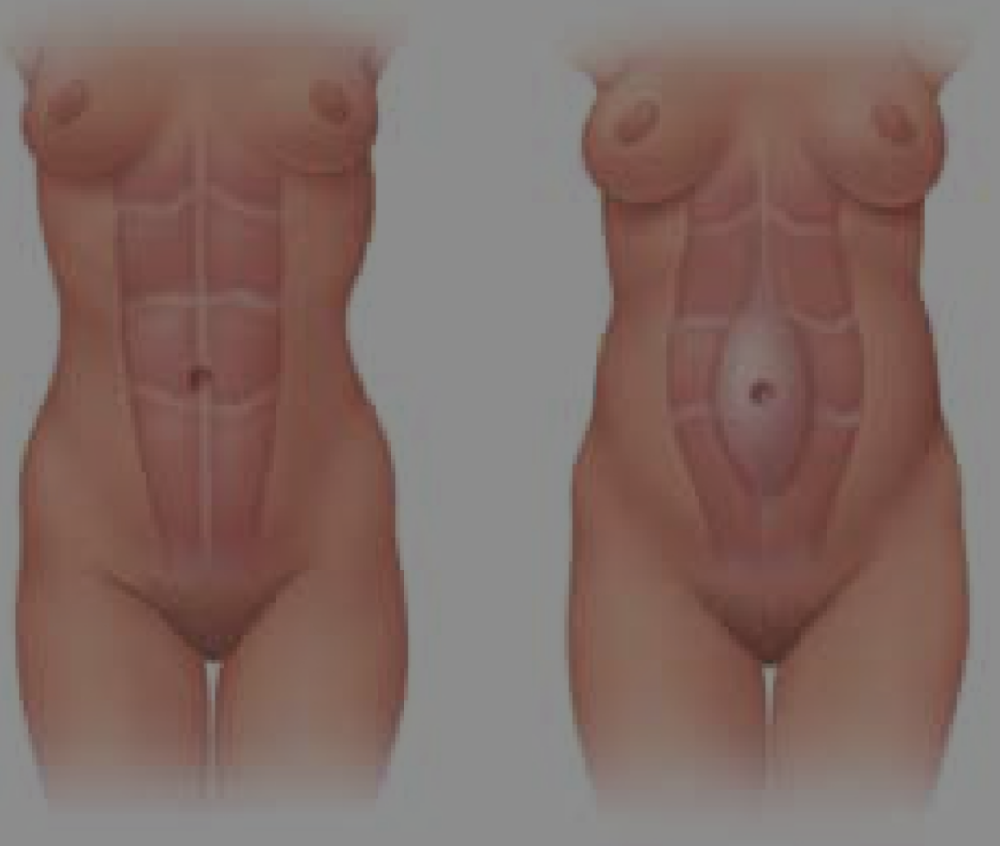

import { Aside } from 'astro-pure/user';

<Aside type='caution'>
 本文不构成医疗建议。
</Aside>

孕周的计算：从末次月经数开始计算孕周，40周后为预产期。这表示这40周中包含月经期，而实际上你的身体还没有真正怀孕。通常真正的怀孕发生在末次月经开始后的两周。

## 一、 孕六周抓紧时间建档

因为医院的床位有限，通常会根据建档时间锁定远期的床位。分为“社区建册”和“医院建档”两步。

1. **办理《北京市母子健康档案》（社区建册）：** 通常在孕满6周（按末次月经第一天计算）后，在孕妇户口所在地或居住地所属的社区卫生服务中心申请建册。提供夫妻双方身份证、结婚证、户口本（或北京市居住证）、医院出具的怀孕证明（血HCG或B超单）。

    <Aside type='tip'>
     社区建册可以线上办理。
    </Aside>

2. **医院建档：**由于北京三甲医院（如北医三院、北京妇产医院）产科床位紧张，建议确认怀孕后立刻了解心仪医院的建档名额和要求。 携带《母子健康手册》、医院要求的检查单（如B超单、艾梅乙筛查等）到医院产科办理预约建档。

    [北京医院建档参考](/docs/bjtown/fuchan)

## 二、 孕周概览

<Aside type='caution'>
  早期流产常常与染色体异常或其他胎儿生长问题有关——与你做了什么或没做什么基本不相关。
</Aside>

## 三、 孕早期的反应

早孕反应会影响50%～80%的孕妇，典型的症状和体征出现在孕5～8周，有时从受孕第2周就会开始出现症状。通常在怀孕13～14周前就会减弱。通常早孕反应不需要治疗，但在家里的一些调养方法，如少食多餐、少量饮用一些姜茶可以帮助缓解恶心的症状。非常罕见的，有时非常重症的早孕反应，分级为妊娠剧吐，可能需要住院静脉补液和用药治疗。

<Aside type='tip'>
 缓解孕吐：
  选择低油脂的食物-选择那些温和干燥、容易消化和脂肪含量低的食物
  多吃零食、少食多餐-早晨起床之前，可以吃一些苏打饼干或者一片烤面包片。全天少食多餐，而不仅限于一日三餐。胃中过空可能会加重恶心症状。
  保持通风-保持室内通风良好，别有烹饪的气味。尽量呼吸新鲜空气。
</Aside>

<Aside type='caution'>
怀孕的第三个月是孕早期的最后一个月。一些孕早期的不舒服和令人不安的事，如晨吐、疲劳、尿频等，这个月将尤其严重
</Aside>

第3个月，由于子宫体积不断增大，并且更靠近膀胱，你可能会因尿频而需要经常小便。在这个月末之前，你的子宫会长出盆腔，膀胱的压迫症状就会有所好转。

在最初的12周时间里，因怀孕需求巨大，你的循环血容量增长迅速。到怀孕晚期，血容量将比孕前增长30%～50%。为了适应血流的增加，你的心脏泵血将更加有力和快速，脉搏可能每分钟增加多达15次。这些改变是你孕早期感觉疲惫的重要原因。你可能在晚饭后就想要上床睡觉，或者觉得在白天需要小憩一下。

## 四、核心孕检项目

建档后，需按医生嘱咐定期进行产检。以下为常规核心产检项目：

| 孕周          | 核心检查项目                         | 检查目的                                           |
| :------------ | :----------------------------------- | :------------------------------------------------- |
| 11 - 13周+6天 | NT超声检查                           | 测量胎儿颈项透明层厚度，早期唐氏综合征筛查。       |
| 15 - 20周     | 唐氏筛查 / 无创DNA (NIPT) / 羊水穿刺 | 排查胎儿染色体异常风险。                           |
| 20 - 24周     | B超大排畸 (系统超声)                 | 详细筛查胎儿器官发育情况，排除严重结构畸形。       |
| 24 - 28周     | OGTT (口服葡萄糖耐量试验)            | 筛查妊娠期糖尿病。                                 |
| 30 - 32周     | B超小排畸                            | 评估胎儿生长发育情况及晚发畸形筛查。               |
| 36周 - 分娩   | 胎心监护、骨盆测量、B超、GBS筛查     | 每周一次胎心监护，评估胎儿宫内状况，制定分娩计划。 |

## 五、孕期饮食指南

* **重点补充：**
    *  **叶酸：** 孕前3个月至孕早期3个月，每日补充0.4-0.8mg，预防神经管缺陷。
    * **铁与钙：** 孕中晚期增加红肉、绿叶蔬菜摄入防贫血；增加奶制品摄入，必要时在医生指导下补充钙剂。
    * **优质蛋白：** 鱼、禽、蛋、瘦肉及大豆制品。
* **严格避免：**
    * 生肉、生鱼片、生蛋（如溏心蛋）、未巴氏杀菌的奶制品及果汁（防李斯特菌和弓形虫感染）。
    * 高汞鱼类（如剑鱼、鲨鱼、马林鱼）。
* **限制摄入：**
    * 咖啡因每日摄入量建议控制在200mg以内（约等于一杯12oz的星巴克美式）；控制高糖高脂食物以防妊娠期糖尿病和体重过度增长。

<Aside type='tip'>
孕期维生素：
  选择了“爱乐维复合维生素片”，因为它是药准字。
  购买渠道：京东大药房，
</Aside>

## 六、 孕期生活与日常护理

### 1. 性生活注意事项

对于健康且无并发症的孕妇，孕期是可以有性生活的，但需注意阶段性风险：

* **孕早期（前3个月）：** 胎盘尚未稳固，建议尽量避免或减少性生活，以防流产。
* **孕中期（4-7个月）：** 相对最安全的时期。孕妇身体状况较平稳，但需注意姿势，避免压迫腹部，动作宜轻柔。
* **孕晚期（后3个月）：** 建议避免性生活，以免引起宫缩导致早产或胎膜早破。
* **绝对禁忌人群：**有先兆流产史、前置胎盘、胎盘低置、阴道出血、宫颈机能不全或破水等高危情况者，孕期严禁性生活。

### 2. 护肤品与化妆品选择

孕期由于激素变化，皮肤可能变得敏感或出现色素沉着（孕妇斑）。日常护肤应以“基础保湿、温和防晒”为主。

* **推荐成分：** 透明质酸（玻尿酸）、甘油、神经酰胺等基础保湿成分；物理防晒（氧化锌、二氧化钛）。
* **严禁使用的成分：** 
    * **维A酸类（Retinoids/视黄醇）：** 常用于抗衰和祛痘，口服及外用均有致畸风险。
    * **水杨酸（Salicylic Acid）：** 高浓度使用可能有害，建议避免。
    * **对苯二酚（Hydroquinone）：** 常用于美白淡斑，系统吸收率高，不建议使用。
    * **某些精油与香水：** 避免使用含有麝香、红花、薰衣草等具有活血或刺激宫缩作用的精油。
* **化妆：** 日常淡妆是安全的，注意彻底卸妆。尽量避免频繁染发、烫发和做指甲（避免接触甲醛、甲苯等挥发性有害物质）。

<Aside type='tip'>
  使用“美丽修行“APP查询
</Aside>

## 七、 孕期禁忌品与药品安全

### 1. 绝对禁忌品

* **酒精：**任何形式的酒精都会通过胎盘，可能导致胎儿酒精综合征（FAS），影响智力和发育。孕期没有安全的饮酒量，必须滴酒不沾。
* **烟草与电子烟：**包括二手烟。吸烟会增加流产、早产、低出生体重及婴儿猝死综合征的风险。
* **毒品及违禁药物。**

### 2. 药品使用原则

孕期用药必须格外谨慎，严格遵循**“非必要不用药，用药必遵医嘱”**的原则。

* **药品分级：**医学上通常参考FDA的妊娠期用药分级（A、B、C、D、X）。A级和B级相对安全，X级绝对禁用。
* **常见疾病用药：**
    * **发烧/疼痛：**对乙酰氨基酚（如泰诺林）通常被认为是孕期首选的解热镇痛药（B级）。
    * **禁用药：**布洛芬等非甾体抗炎药在孕晚期使用可能导致胎儿动脉导管早闭，应避免使用。
    * **感冒：**避免使用含有多种成分的复方感冒药，因为其中可能含有伪麻黄碱（收缩血管）等不利于胎儿的成分。
* **慢性病管理：**如有甲状腺疾病、高血压、糖尿病等基础病，需在专科医生指导下调整孕期安全用药，切勿自行停药。

## 八、孕期常见症状

### 1. 需要就医的症状

阴道流血。血尿或者尿痛。腹部绞痛。阴道排出组织物。发热。

### 2. 腰背痛

缓解方式：养成良好的姿势。收紧臀部，肩膀向后向下垂，站立笔直。注意坐、立、行走的姿势。经常变换姿势，避免长时间站立。避免提拉重物或者抱孩子。拾捡东西采取正确姿势。不要弯腰，而是蹲下、弯曲膝部，然后用你的大腿而不是腰部带动你起身。当你不得不长时间站立时，请将一只脚放在一个小板凳上。穿低跟或者平跟鞋。一周至少锻炼3次（游泳、散步或者拉伸）。尝试舒适的睡觉姿势。侧卧并弯曲双膝或者单膝，两膝之间及肚子下各放置一常规枕头。也可使用特殊形状的身体枕放松身体。

### 3. 腹部压痛

孕期子宫的逐渐增大，撑开了腹壁正中两条紧挨的、平行的肌肉（腹直肌），我们称之为“腹直肌分离”。

通常腹直肌分离是无须临床治疗的。但是医生会帮你评估腹直肌分离的严重程度，并且给予你分娩后的补救指导。
