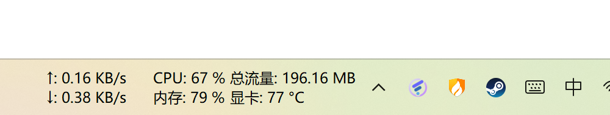
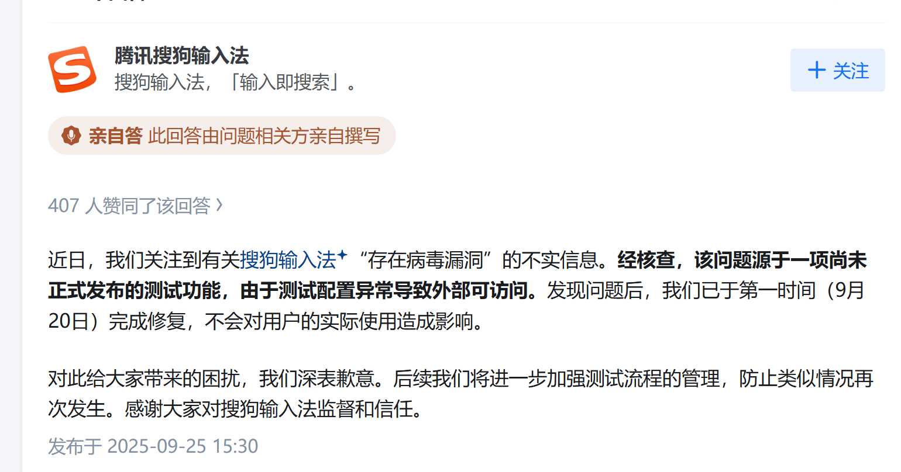

## 写博客套装

 ### 1. Typora

[https://typoraio.cn/](https://typoraio.cn/)

Markdown文档处理，图片自动上传/处理。

### 2. Github Desktop

[https://desktop.github.com/download/](https://desktop.github.com/download/)

Git 工具，将静态网站托管到Github

### 3.PICGO

[https://github.com/Molunerfinn/PicGo/releases](https://github.com/Molunerfinn/PicGo/releases)

考虑到博客越写越多，图片存储到腾讯云对象云存储（COS）。通过PICGO可以搭配Typora自动上传图片至腾讯云COS。

## 网络服务

### 1.Chrome浏览器

[https://www.google.com/intl/zh-CN/chrome/](https://www.google.com/intl/zh-CN/chrome/)

Windows自带的Edge或者Mac自带的Safari已经足够好用。Chrome浏览器主要是因为保存了各类网站密码。

### 2.FL Clash代理工具

[https://github.com/chen08209/FlClash/releases](https://github.com/chen08209/FlClash/releases)

A multi-platform proxy client based on ClashMeta,simple and easy to use, open-source and ad-free.

Multi-platform: Android, Windows, macOS and Linux

### 3. 流量/网速监控

[https://github.com/zhongyang219/TrafficMonitor](https://github.com/zhongyang219/TrafficMonitor)

Traffic Monitor是一款用于Windows平台的网速监控悬浮窗软件，可以显示当前网速、CPU及内存利用率，支持嵌入到任务栏显示，支持更换皮肤、历史流量统计等功能。

我很需要看目前的实时网速，它可以嵌入任务栏，非常美观且方便。

## 软件管理

### 1.Geek 卸载器

[https://geekuninstaller.com/](https://geekuninstaller.com/)

干净地卸载软件，清除残留。

### 2. 火绒

[https://www.huorong.cn/](https://www.huorong.cn/)

很多人说火绒的杀毒能力不行。但是用来管理开机启动项、右键菜单等，当作电脑管家是当之无愧的。静默不打扰。注意很多仿冒软件，一定要访问官网下载。

### 3. Steam-游戏

[https://store.steampowered.com/](https://store.steampowered.com/)

下载正版游戏。Steam的仿冒软件太多了。注意访问官网。

## 实用工具

### 1.抢票软件Bypass

[https://www.bypass.cn/](https://www.bypass.cn/)

分流抢票是一款完全免费的抢票软件，全程自动抢票、自动抢候补、整点抢预售、稳定捡漏。支持多天、多车次、多席别、多乘客、多站查询、多任务等功能，支持各种提醒、选座和选铺、改签刷票、增开监控，自动支付等

## 2.压缩软件7-zip

https://www.7-zip.org/

中文站：https://sparanoid.com/lab/7z/

## 避雷-黑名单内的立即卸载

### 1.搜狗输入法

近期，火绒的一篇文章“[搜狗输入法云控下发模块，“暗中”篡改浏览器配置](https://www.huorong.cn/document/tech/vir_report/1845)”揭露了搜狗输入法的邪恶嘴脸，搜狗输入法通过技术手段，结合用户画像：例如所在地区、时间等诸多维度进行精准推送，首先检测用户设备上的杀毒软件，随后通过篡改配置文件的方式，强制修改 Edge 与 Chrome 两款主流浏览器的主页及默认搜索引擎设置。

这间接证明了搜狗将用户输入内容等隐私内容上传至云端，再通过窃取来的隐私塑造用户画像，最终为用户“量身定制”一套搜索引擎和广告推销，导向其灰色产业收入。

搜狗对此的回应简直是不要脸！

### 2.360全家桶

一人得道，鸡犬升天。很快你的电脑就变成360的摇钱树，开机广告、屏保广告、链接劫持、文件劫持，不是肉鸡，胜似肉鸡。

### 3.百度网盘

劫持系统。劫持篡改了电脑的看图软件。详见[百度网盘被发现安装智能看图插件劫持图片打开方式 整个界面还是抄微软的](https://www.landiannews.com/archives/110368.html)