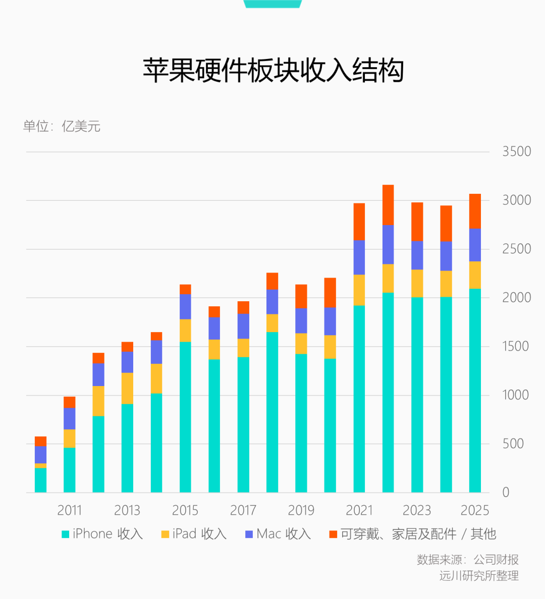
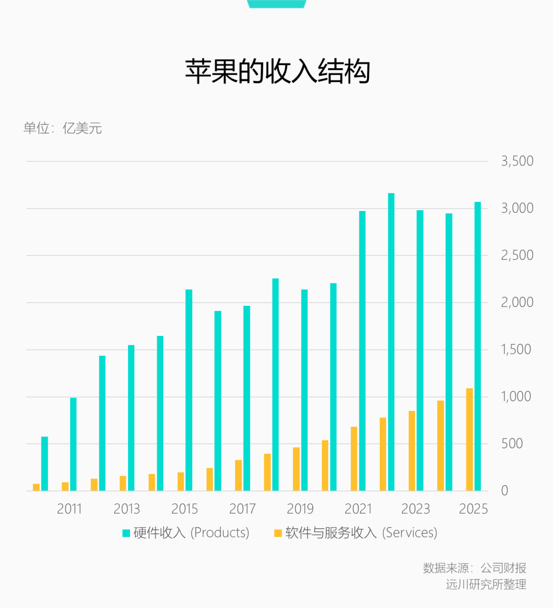
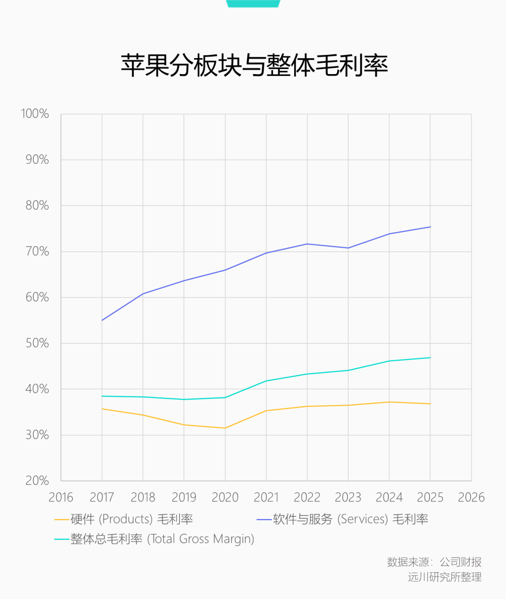
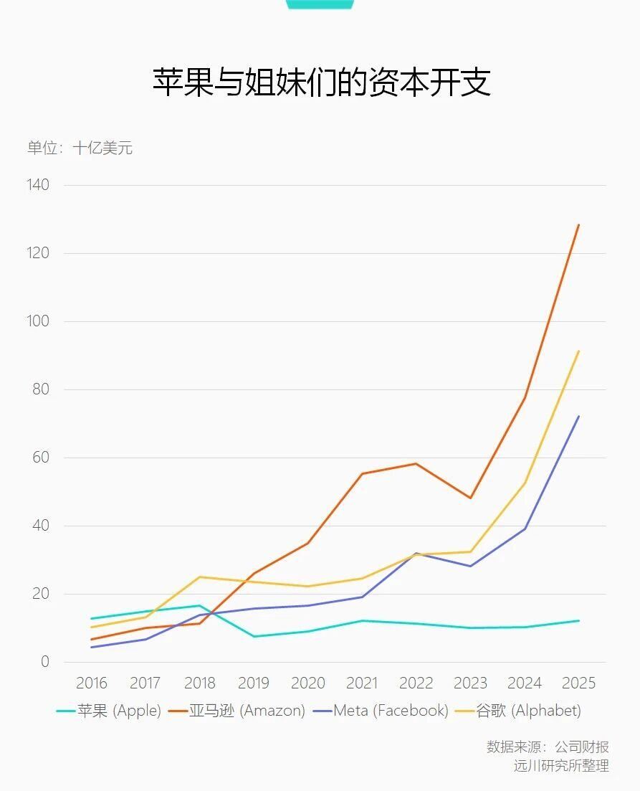

## 截至2025年苹果的一些财务数据

## 苹果放弃造车的原因

苹果放弃汽车业务的原因众说纷纭，但有一点可以确定，即苹果无法在汽车产业复制自己对供应链强大的话语权。

在手机的供应链上，苹果不亲自研发生产零部件，而是用丰厚的订单指挥OEM企业。由苹果提出设计目标，技术送上马，设备扶一程，研发费用尽管开发票。苹果在库克治下成为了名副其实的半导体帝国。除了大名鼎鼎的A系列芯片，苹果用M踢开了英特尔，在久攻不下的基带芯片上成功摆脱了高通。

但是在新能源汽车领域，一方面，特斯拉已经先于苹果掌控了核心环节（芯片/算法），另一方面，宁德时代等供应商愿不愿意没事给自己找个爹。

## 拓展阅读

[2026年4月22日-远川研究所-《告别库克时代，苹果的未来并不乐观》](https://mp.weixin.qq.com/s/1rGDAem6RWLzoDBcgtD1YA)