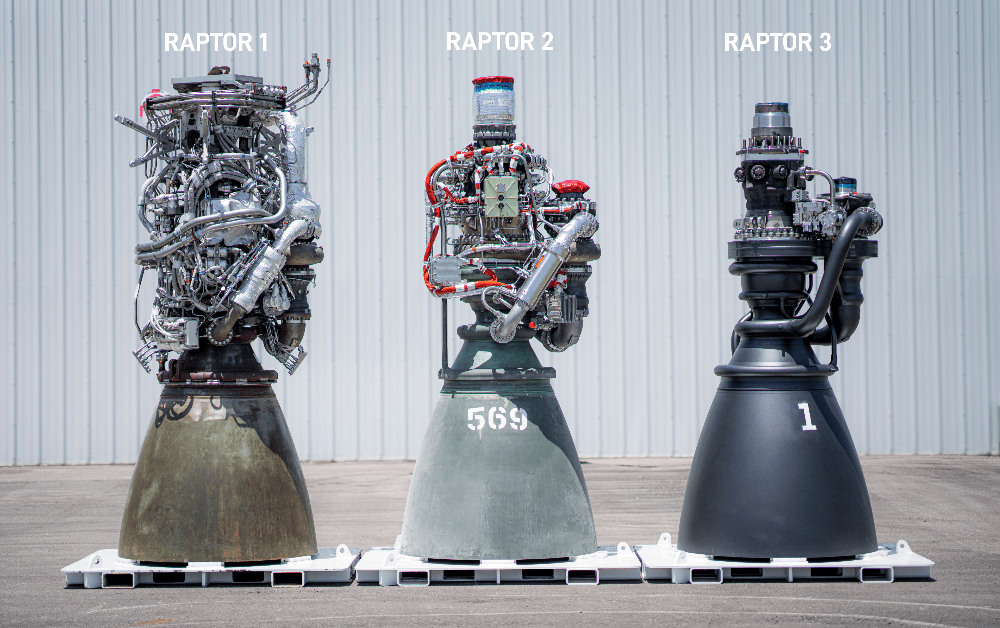
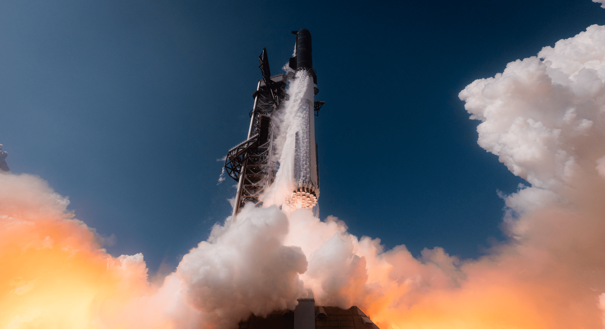
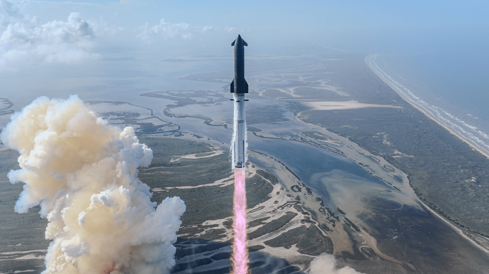
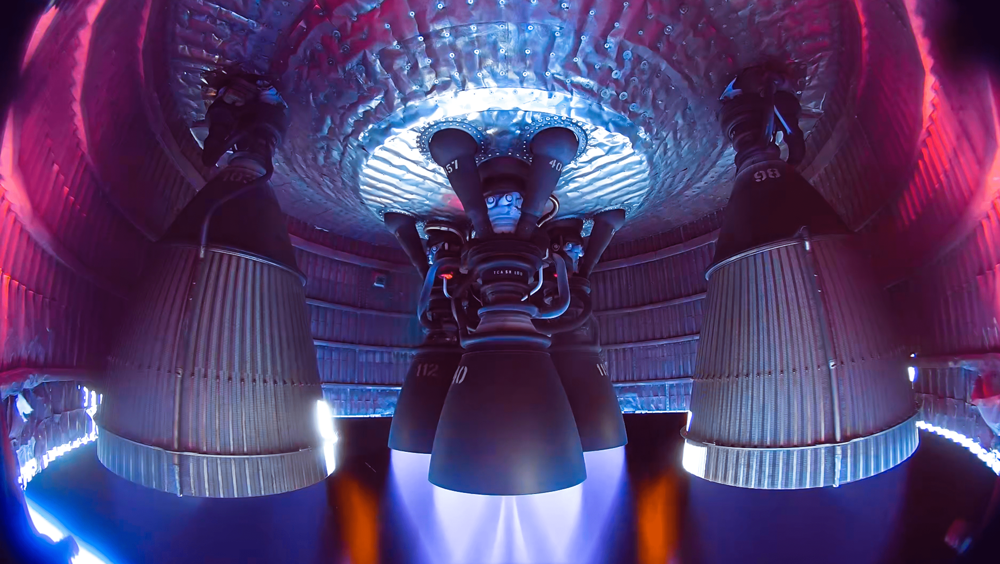
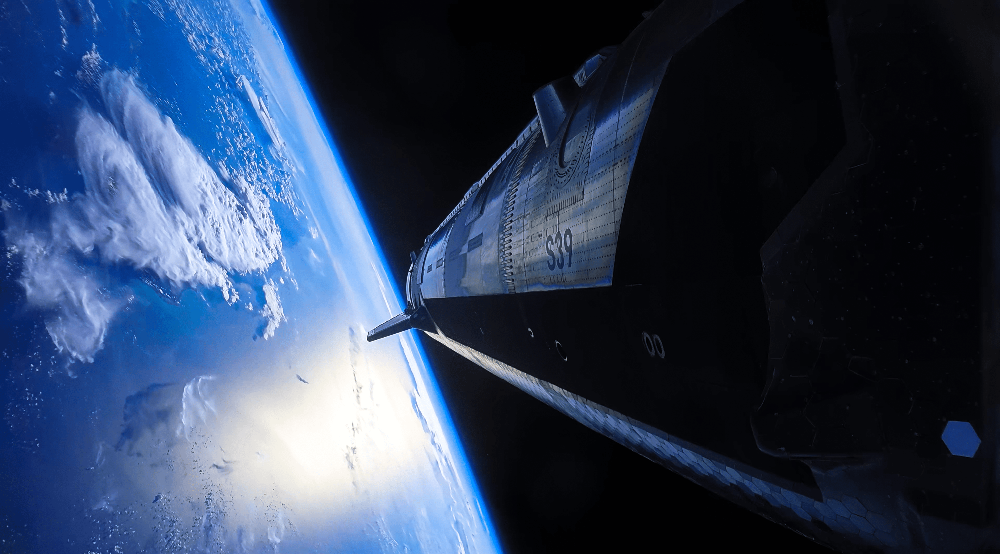

import { Aside } from 'astro-pure/user'

## 猛禽发动机

<Aside type='tip'>
 如果不标注出来，是不是很容易认为最左侧是猛禽3？恰恰相反，从左到右依次是猛禽1、猛禽2和猛禽3。
</Aside>

## 第十二次实验

##  IPO申报

SpaceX 的使命：即让生命成为 **多行星文明** 、探究宇宙真谛，并将意识之光播撒至繁星之中。

SpaceX’s mission: to make life **multiplanetary** , to understand the true nature of the universe, and to extend the light of consciousness to the stars.

核心理念： **工程至上文化（Engineering-First Culture）** ，“第一性原理思考”。

SpaceX的三大业务：太空、星链链接、AI。星链连接业务2025年的EBITDA为72亿美元，是唯一盈利的业务。

| 报告项目          | 2026 年 Q1 (截至3月31日) | 2025 全年  | 同比/变动情况 |
| :---------------- | :----------------------- | :--------- | :------------ |
| **合并总收入**    | $46.94 亿                | $186.74 亿 | -             |
| **运营亏损**      | $19.43 亿                | $25.89 亿  | -             |
| **调整后 EBITDA** | $11.27 亿                | $65.84 亿  | -             |

各业务核心数据

| 业务领域                | 报告维度  | 营收 (Revenue) | 运营收益/亏损     | 调整后 EBITDA | 研发投入 (Starship) |
| :---------------------- | :-------- | :------------- | :---------------- | :------------ | :------------------ |
| **太空 (Space)**        | 2026 Q1   | $6.19 亿       | -$6.62 亿 (亏损)  | -$3.51 亿     | $9.30 亿            |
|                         | 2025 全年 | $40.86 亿      | -$6.57 亿 (亏损)  | $6.53 亿      | $30.04 亿           |
| **连接 (Connectivity)** | 2026 Q1   | $32.57 亿      | +$11.88 亿 (收益) | $20.87 亿     | -                   |
| *(Starlink 驱动)*       | 2025 全年 | $113.87 亿     | +$44.23 亿 (收益) | $71.68 亿     | -                   |
| **AI 业务**             | 2026 Q1   | $8.18 亿       | -$24.69 亿 (亏损) | -$6.09 亿     | -                   |
| *(新收购领域)*          | 2025 全年 | $32.01 亿      | -$63.55 亿 (亏损) | -$12.37 亿    | -                   |

资本支出对比：

| 业务领域                | 2026 Q1 资本支出 | 2025 全年资本支出 | 备注                     |
| :---------------------- | :--------------- | :---------------- | :----------------------- |
| **太空 (Space)**        | $10.52 亿        | $38.32 亿         | 用于基础设施及载具研发   |
| **连接 (Connectivity)** | $13.32 亿        | $41.78 亿         | 主要支撑网络扩展         |
| **AI 业务**             | $77.23 亿        | $127.27 亿        | 反映高投入的早期发展阶段 |
| **总计**                | **$101.07 亿**   | **$207.37 亿**    |                          |

三大业务是相辅相成的：

太空业务：通过可重复使用的 Falcon 9 和 Falcon Heavy 火箭，为商业、民用、国际及政府客户提供卫星、货物和载人任务的发射服务。除了向第三方销售发射任务外，还可以用于自身低成本发射数千颗近地轨道卫星、形成星链系统（Starlink ）。

星链：提供消费者宽带、企业解决方案、政府解决方案以及 Starlink Mobile。家庭消费者的峰值时段中位速度为 225 Mbps（大约 28MB/s，这个速度足以满足一般用户的需求）， 2026 年下半年利用 Starship 开始部署下一代 V3 卫星进一步扩容。**Starlink Mobile：** 提供“卫星到移动设备”的连接能力。星链的最核心作用是，全球覆盖，不需要基站，减少信号盲区。

AI则包括LLM大语言模型和芯片制造、数据中心等。打造**真理探索前沿模型（Truth-Seeking Frontier Model）** 。AI和太空业务又是怎么产生联系呢？ 那就是能源。太阳拥有整个太阳系约 99.8% 的能量，逻辑上最可行的前进方向， **就是将高能耗的 AI 工作负载转移到轨道上** ，因为那里的太阳能近乎恒定且永不中断。SpaceX 拥有独特的优势来部署和运营轨道数据中心，并最终在未来实现比地面数据中心更低的成本。

