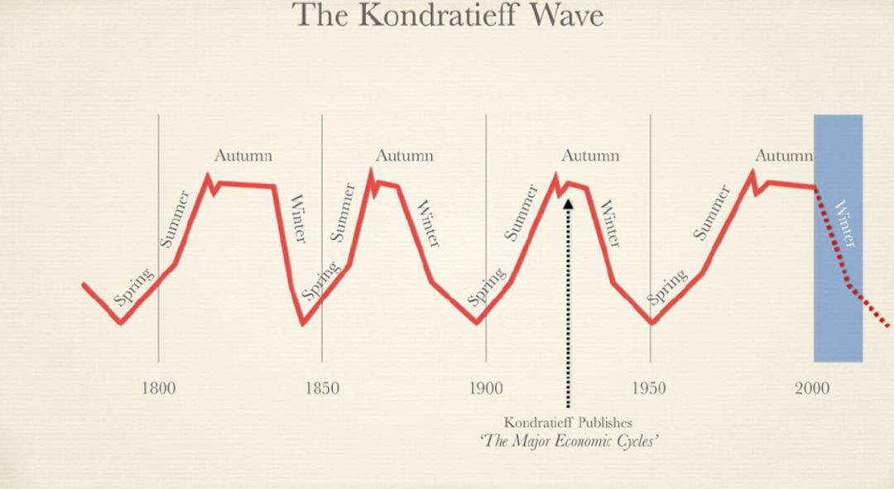

康德拉季耶夫和一组经济学家同事研究价格指数、经济景气周期，在1922年发表的著作《大经济循环》( The Major Economic Cycles)中提出了著名的康波周期长波理论。

康波周期是指以价格、工资、利率等基本经济指标以55到60年为一周期的进行波动，这一过程恰好符合一自然人的生命周期。

**图中蓝色的部分表示了当前我们正在康波周期中的下行阶段中前进了多久。**

如果将2000年看作上一周期的顶点，而中国的顶点则由于人口红利，以及城市化过程中乡村人口对经济的输血行为而多延续了十年。

2020-2030年恰好处于这一周期的最低点，至少从2030年开始，这一周期开始进入恢复。

康波周期的思想来源之一是熊彼得的增长理论模型，他认为创新不是随机散点分布的，而是以“蜂聚”的形式出现的。

社会( 资本) 积累结构( Social Structures of Accumulation，SSA) 理论也构成周期理论的基础，这一理论认为，周期的长波起伏是社会积累结构在促进资本积累上的成功或失败的结果。