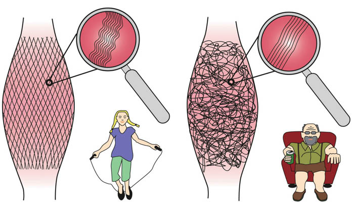

## 一、什么是筋膜？

筋膜（Fascia）是一种覆盖在肌肉、骨骼、血管和神经外层的结缔组织网，就像一张全身的“蜘蛛网”，把我们的身体结构有序地联系在一起。它不仅起到支撑和包裹的作用，还影响着身体的运动协调和力量传导。

附着在肌肉上的筋膜并不是完全平整的，而是略微呈波浪状，就像卷发一样。因为这种结构，筋膜才能够拉伸，并且能够储存能量。

筋膜的波浪状结构越明显，它的弹性和能量储存能力就越大。一般而言，随着年龄增加，波浪状结构会越来越不明显，但通过正确的训练是可以恢复的。

简单来说，筋膜就像衣服的“内衬”，如果这个内衬出现褶皱或粘连，身体就会感到紧绷、酸痛，甚至影响动作表现。

筋膜贯穿全身，有些位于皮肤表层，有些则在深层，有些还包裹着器官。我们之所以能做动作主要归功于筋膜：每一块肌肉、每一束纤维束甚至每一条纤维都是被一层薄薄的筋膜包裹着的，这些筋膜将肌纤维的力量传递出去，同时协助肌纤维束移动，从而让肌肉顺利地工作

主要成分：人体内所有结缔组织的结构成分完全相同，它们是一些或紧密或疏松连接在一起的纤维。但是，这些纤维的含水量并不固定。因此，由纤维串联构成的网络可能具有极佳的弹性，也可能十分厚实，不易被撕裂，或者既松散又柔软。它们都是由相同的成分——胶原蛋白、弹性蛋白和一种液态的基质构成的，只是各成分的比例不同而已。

## 二、为什么要进行筋膜放松？

人到中年后，筋膜健康变得越来越重要。佝偻的体态，也就是典型的老年人上半身向前弯曲和驼背的体态，很大程度上是筋膜老化的结果。**此外，缺乏锻炼的筋膜容易粘连，而筋膜粘连严重会导致四肢僵硬、身体不灵活。**

我们的机体完全奉行“用进废退”原则。尤其是我们的骨骼、肌肉、筋膜和神经系统，它们遵循这个原则，不断地在体内淘汰和更新。日本科学家在显微镜下观察缺乏锻炼的人的筋膜时，发现他们的筋膜都打结了！

在办公室久坐的人通常都有肩部酸痛的问题，这是因为人的身体结构并不适合长时间保持同一个姿势，久坐不动会使肌肉紧绷、僵硬。我们的肩部有非常厚实的筋膜，它们不仅与胸部肌肉相连，还与背部到手臂的肌肉相连，一路往下连接到骨盆。这样的身体结构是为了让人类的祖先能在树林中荡来荡去而“量身打造”的。身体的某个部位长期承受过大的压力，自然容易僵硬和紧绷，特别是伏案工作的姿势违反了人体工学，更容易导致身体僵硬和紧绷。肩关节的筋膜也容易粘连，这除了让人感到疼痛，严重时还可能导致肩关节活动困难，这就是我们常说的肩周炎或“凝肩”；髋关节疼痛和不灵活也是一种非常普遍的现象。

所以一定要开展筋膜的放松和训练，但是与肌肉训练相比见效慢，因为与肌纤维的更新速度相比，结缔组织细胞的更新速度比较慢。

筋膜放松有以下好处：

1. 缓解肌肉紧张与酸痛：运动后乳酸堆积、长时间久坐或姿势不良，都会让筋膜变得僵硬，造成酸胀。放松筋膜能帮助缓解不适。
2. 提升关节灵活性：柔软的筋膜能让身体动作更加顺畅，减少受伤风险。
3. 改善血液循环：松弛的筋膜有助于促进血液和淋巴流动，提升代谢效率。
4. 辅助运动表现：很多专业运动员都把筋膜放松当作训练前后的“必修课”，它能帮助肌肉恢复，提升爆发力和协调性。

## 三、常见的筋膜放松工具

我们可以通过自我按摩的方式让筋膜再生并且恢复活力。在练习中，我们需要使用泡沫轴和筋膜球，你也可以用网球或橡皮球作为按摩工具。通过按摩对筋膜施压，是纯粹的物理机制，压力能促进筋膜中的液体交换。筋膜就像一块海绵，按摩能够帮助筋膜将新陈代谢的废物和淋巴液排出，再吸入新鲜的液体。

### 常用工具：

- 泡沫轴（Foam Roller）：最常见的工具，适合大腿、背部等大肌群。

> 泡沫轴使用注意事项：1.自重施压，15-30s，2cm移动范围，在痛点上着重按压；2.不要滚压肌腱和关节，而是两侧肌肉；3.泡沫轴滚压部位：大腿三个部分，臀部两部分，竖脊肌，中下斜方肌，背阔肌，肱三头肌，胸大肌；4.小臂、肱二头、小腿可大拇指推拿左右互搏，力一定要吃进去。

- 筋膜球（Lacrosse Ball/筋膜球）：直径较小，适合放松臀部深层、小腿和足底筋膜。
- 按摩枪：方便快捷，适合下班或训练后快速放松。
- 瑜伽砖、拉伸带：辅助身体做被动拉伸，延展筋膜。

### 常用手法：

1. 滚压放松：利用泡沫轴或筋膜球，在肌肉上缓慢滚动，每个点位停留 20-40 秒，感受酸胀但可耐受的压力。
2. 点压放松：用球或者按摩枪针对结节点（触感硬块或酸点）进行按压，帮助松解粘连。
3. 拉伸结合：放松后配合动态或静态拉伸，效果更佳。
4. 呼吸与放松：深呼吸能帮助神经系统放松，让筋膜释放更充分。

### 注意事项：

- 放松时要循序渐进，不要用力过猛。
- 避开关节、骨骼等硬组织，专注于肌肉和软组织。

筋膜放松不是奢侈的保养，而是现代人必备的身体管理方式。无论你是健身爱好者、办公室白领，还是只是想让身体更轻松的人，都可以把筋膜放松加入日常习惯。坚持下来，你会发现身体更灵活、精神更轻盈。

## 四、生活习惯方面

筋膜需要充足的**水分**补给，因为它的70%都是水。因此，你每天要喝1.5-2升水。

**蛋白质**是筋膜最重要的组成部分。人体需要特定的蛋白质来制造纤维，而这些蛋白质必须通过食物来获取，因为人体自身无法合成。足够的蛋白质摄入量是人体结缔组织细胞制造出纤维的前提条件。动物蛋白质比植物蛋白质更容易被人体吸收。

筋膜中胶原蛋白的合成需要**维生素C**，维生素C相当于黏合剂，能使胶原纤维黏合在一起。如果人体严重缺乏维生素C，胶原蛋白的合成受到干扰，身体组织就会出现维生素C缺乏的症状，如牙龈出血、伤口愈合不良、骨膜脱落、皮肤角化等，尤其是坏血病。因此，维生素C对筋膜来说不可或缺。

锌是人体比较容易缺乏的少数维生素中的一种，**锌是人体必不可少的微量元素**，它参与人体蛋白质、脂肪和细胞的新陈代谢，能够增强人体的免疫功能，还会影响人体内胰岛素的分泌。人体内的激素发挥作用也离不开锌，尤其是甲状腺素和雄性激素（睾酮素），雄性激素能强化男性和女性体内的筋膜。锌还对伤口愈合有利，它存在于结缔组织细胞的细胞壁内，也参与胶原蛋白的合成。人体缺锌会导致伤口愈合不良、筋膜软弱无力、抵抗力下降。富含锌的食物有牛肉、猪肉、鸡蛋、牛奶、奶酪、豆类、坚果、海鲜和动物内脏。与植物源性食物相比，动物源性食物中的锌更容易被人体吸收。

只有在深度睡眠状态下，人体才会分泌生长激素（HGH），它能刺激结缔组织细胞中胶原蛋白的合成。

## 视频教程

