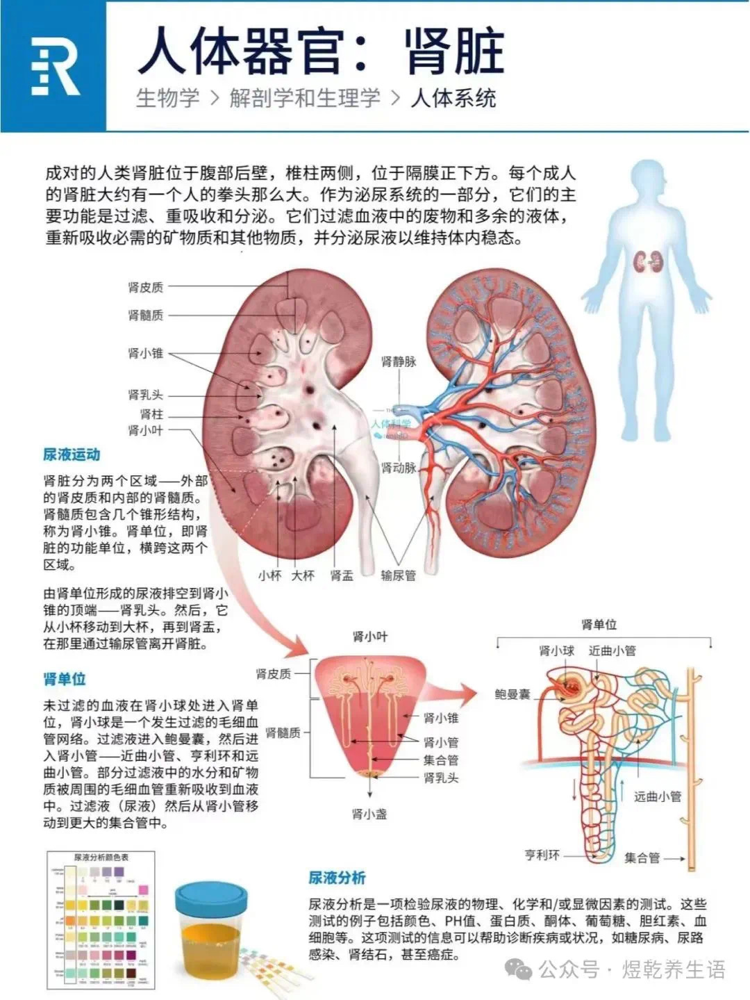
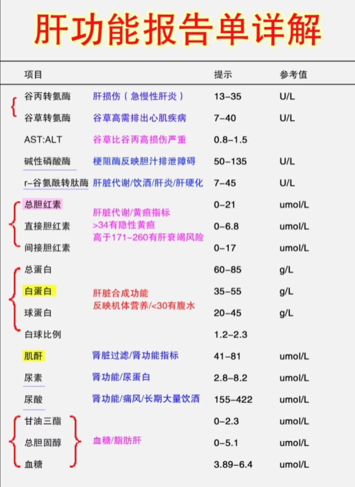

## 肾脏

### 肾脏的功能有哪些？

肾脏是人体重要的排泄器官，具有多种功能，主要包括以下几个方面：

1. 排泄废物：肾脏通过过滤血液，将代谢废物（如尿素、肌酐、尿酸等）和多余的水分排出体外，形成尿液。
2. 调节体液平衡：肾脏通过调节尿液的生成和排泄，维持体内水分和电解质的平衡，确保体液环境的稳定。
3. 调节电解质平衡：肾脏能够调节钠、钾、钙、磷等电解质的浓度，维持体内电解质平衡，确保神经、肌肉等组织的正常功能。
4. 调节酸碱平衡：肾脏通过排泄酸性或碱性物质，调节体内的酸碱平衡，维持血液pH值在正常范围内。
5. 分泌激素：
   - 促红细胞生成素（EPO）：肾脏分泌的EPO能够刺激骨髓生成红细胞，维持正常的血液携氧能力。
   - 肾素：肾脏分泌的肾素参与调节血压和体液平衡，通过肾素-血管紧张素-醛固酮系统（RAAS）发挥作用。
   - 活性维生素D：肾脏将维生素D转化为其活性形式（1,25-二羟维生素D3），促进钙的吸收和骨骼健康。
6. 调节血压：肾脏通过调节体液量和分泌肾素等激素，参与血压的调节。
7. 代谢功能：肾脏参与某些物质的代谢，如将氨基酸转化为葡萄糖（糖异生）等。
8. 清除毒素：肾脏能够清除血液中的外源性毒素和药物代谢产物，帮助维持体内环境的清洁。

总之，肾脏在维持体内环境稳定、排泄废物、调节体液和电解质平衡、分泌激素等方面发挥着至关重要的作用。肾脏功能的异常可能导致多种疾病，如肾功能衰竭、高血压、电解质紊乱等。

### 只有一个肾脏会有什么影响？

只有一个肾脏通常不会对健康产生显著影响，因为一个健康的肾脏足以维持身体的正常功能。以下是只有一个肾脏可能产生的影响：

1. 正常生活：大多数人天生有两个肾脏，但有些人可能因为先天原因（如先天性单肾）或后天原因（如手术切除一个肾脏）而只有一个肾脏。只要剩下的肾脏功能正常，通常可以维持正常的生活。
2. 肾功能储备减少：虽然一个健康的肾脏可以满足身体的需求，但肾脏的储备功能会减少。这意味着如果剩下的肾脏出现问题，身体可能更容易受到肾功能不全的影响。
3. 定期监测：只有一个肾脏的人需要定期进行肾功能检查，以确保剩下的肾脏健康。医生可能会建议定期检查血压、尿液和血液中的肌酐水平，以监测肾脏功能。
4. 避免过度负担：为了保护剩下的肾脏，建议避免过度使用某些药物（如非甾体抗炎药）、保持健康的饮食、控制血压和血糖，以及避免过度饮酒和吸烟。
5. 潜在风险：虽然一个健康的肾脏通常足以维持正常生活，但在某些情况下（如严重感染、创伤或慢性疾病），只有一个肾脏的人可能面临更高的风险。因此，保持健康的生活方式非常重要。

总的来说，只要剩下的肾脏功能正常，只有一个肾脏的人通常可以过上健康的生活，但需要更加注意保护肾脏健康。

### 肾脏相关检查

肾动态检查（又称肾动态显像或放射性核素肾图）是一种核医学检查，主要用于评估肾脏的血流灌注、滤过功能、排泄功能以及尿路通畅情况。它通过静脉注射含有放射性同位素（如锝-99m标记的DTPA或MAG3）的示踪剂，利用γ相机连续拍摄示踪剂在肾脏中的代谢过程，生成时间-放射性曲线（肾图），从而分析肾功能。该检查存在误差。安全性较高。

## 肝

肝脏是人体内最大的实质性器官和最大的腺体，常被称为人体的“超级化工厂”。它执行着超过500种维持生命所必需的生理生化功能。 肝脏是人体内唯一能够进行大规模自然再生的内脏器官。即使因为手术或外伤被切除多达70%-75%，只要剩余的肝组织健康，它也能在几个月内重新生长恢复到原来的大小和功能。

肝脏的功能极其复杂，主要可以归纳为以下五大类：

**1. 代谢枢纽（Metabolism）**

- **糖代谢（调节血糖）：** 维持血糖平衡。进食后，肝脏会将血液中多余的葡萄糖转化为“肝糖原”储存起来；当身体饥饿或需要能量时，它又会将糖原重新分解为葡萄糖释放入血。
- **蛋白质代谢：** 肝脏是合成人体蛋白质的主要场所。它合成维持血浆渗透压的**白蛋白**，以及几乎所有的**凝血因子**（如果肝功能衰竭，人会面临严重的出血风险）。
- **脂肪代谢：** 负责合成胆固醇、甘油三酯和脂蛋白，并将脂肪转化为全身细胞可以利用的能量。

**2. 解毒与排泄（Detoxification）**

- 肝脏是人体的核心“净化器”。无论是体内代谢产生的有毒废物（例如将蛋白质分解产生的剧毒“氨”转化为无毒的“尿素”排出），还是外来的毒素（如酒精、药物、食品添加剂等），肝脏都能通过生化反应将它们分解、中和，转化为低毒或水溶性物质，最终通过尿液或胆汁排出体外。

**3. 分泌胆汁（Bile Production）**

- 肝脏细胞每天持续分泌胆汁（约800-1000毫升）。这些胆汁会通过胆管输送到胆囊中浓缩和储存。当您进食时，胆汁被排入小肠，它的主要作用是**乳化脂肪**，帮助肠道消化和吸收脂肪，以及维生素A、D、E、K等脂溶性维生素。

**4. 重要的“储备仓库”（Storage）**

- 除了储存糖原作为备用能量外，肝脏内还储存着大量人体必需的营养物质，包括脂溶性维生素（A、D、E、K）、维生素B12、叶酸，以及铁、铜等微量元素。

**5. 免疫与防御（Immunity）**

- 肝脏不仅是代谢器官，也是重要的免疫器官。肝脏内壁分布着大量的“库普弗细胞”（Kupffer cells，一种具有强大吞噬能力的巨噬细胞）。它们就像血液过滤网上的“卫士”，能够捕捉并吞噬血液中的细菌、病毒、衰老的红细胞以及其他异物，保护人体免受感染。

### 肝癌难以早期发现

肝癌之所以一发现就是晚期主要有以下几个原因：

1. 早期不疼，无法察觉：肝的主要痛觉感受是在肝包膜上，而内部发生病变一般都不影响到肝包膜。只有肿瘤开始快速发展到挤压肝包膜的时候才会引发疼痛。

2. 肝癌本身早期不影响个体功能：肝脏是可以部分切除的。肝脏本身具有强大的功能，而且甚至无需整个肝脏都可以执行机体的功能，这就意味着，即使是肝脏已经发生了癌变，但是肝脏依然可以完成正常人体所需的功能。

3. 持续进展，容易忽视：不少肝癌的发病顺序大概是肝炎或者脂肪肝之类的一路持续下去。这种情况下，很难进行明确的区分。

规律性的进行体检，是很有必要的！

### 脂肪肝

脂肪肝（Fatty Liver Disease）是指肝脏内脂肪（主要是甘油三酯）过度堆积（超过肝脏重量的5%）的病理状态。根据病因不同，可分为非酒精性脂肪肝（NAFLD）和酒精性脂肪肝（AFLD）两大类。以下是关于脂肪肝的详细说明：

#### 1. 主要类型

- 非酒精性脂肪肝（NAFLD）
  - 与饮酒无关，常见于代谢异常人群（如肥胖、糖尿病、高血脂等）。
  - 包括两种形式：
    - 单纯性脂肪肝（仅脂肪堆积，炎症轻微）。
    - 非酒精性脂肪性肝炎（NASH）（伴随炎症和肝细胞损伤，可能进展为肝硬化或肝癌）。
- 酒精性脂肪肝（AFLD）
  - 由长期过量饮酒导致（男性＞40克/天，女性＞20克/天）。
  - 戒酒后可能逆转，否则可能发展为酒精性肝炎、肝硬化。

#### 2. 常见病因

- 代谢因素：肥胖、胰岛素抵抗、2型糖尿病、高血脂。
- 饮食与生活方式：高糖高脂饮食、久坐、缺乏运动。
- 酒精：长期过量饮酒。
- 其他：快速减肥、药物（如激素）、遗传因素等。

#### 3. 症状与诊断

- 早期症状：多数无症状，部分人可能有疲劳、右上腹隐痛。
- 严重时：肝区胀痛、黄疸、食欲减退。
- 诊断方法：
  - 影像学：超声（最常用）、CT/MRI、FibroScan（检测脂肪含量和纤维化）。
  - 血液检查：肝功能（ALT/AST升高）、血脂、血糖。
  - 肝活检：确诊NASH或纤维化的金标准。

#### 4. 潜在危害

- 单纯脂肪肝可逆，但若不干预可能进展为：
  - 脂肪性肝炎 → 肝纤维化 → 肝硬化 → 肝癌（尤其是NASH）。
  - 增加心血管疾病和糖尿病风险。

#### 5. 治疗与逆转方法

核心：生活方式干预

- 饮食调整：
  - 控制总热量，减少精制糖、饱和脂肪（如油炸食品、甜饮料）。
  - 增加膳食纤维（全谷物、蔬菜）、优质蛋白（鱼、豆类）、抗氧化食物（深色蔬果）。
  - 避免酒精。
- 运动：每周≥150分钟中等强度有氧运动（如快走、游泳）。
- 减重：超重者减重5-10%可显著改善脂肪肝（建议每周减0.5-1公斤）。

药物辅助（需医生指导）

- 针对代谢问题：二甲双胍（糖尿病）、他汀（高血脂）、维生素E（部分NASH患者）。
- 避免使用可能伤肝的药物（如对乙酰氨基酚过量）。

#### 定期随访

- 每6-12个月复查肝功能、超声等。

#### 6. 预防建议

- 保持健康体重（BMI 18.5-24）。
- 均衡饮食，避免酗酒。
- 控制血糖、血脂、血压。
- 避免快速减肥（如极端节食）。

### 何时就医？

- 肝功能持续异常、出现黄疸、腹水或不明原因体重下降。
- 有脂肪肝且合并糖尿病/高血压，需综合管理。

早期脂肪肝通过生活方式改变大多可完全逆转，关键在于长期坚持健康习惯。如有疑问，建议咨询消化内科或肝病科医生。