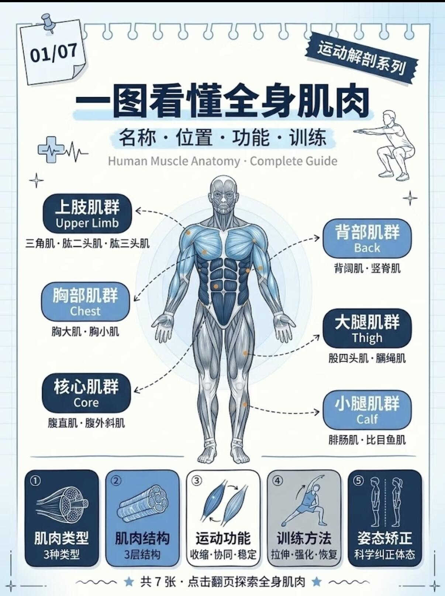
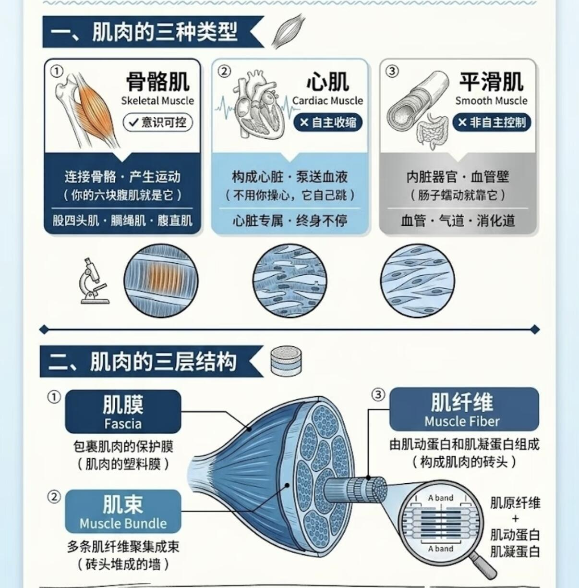
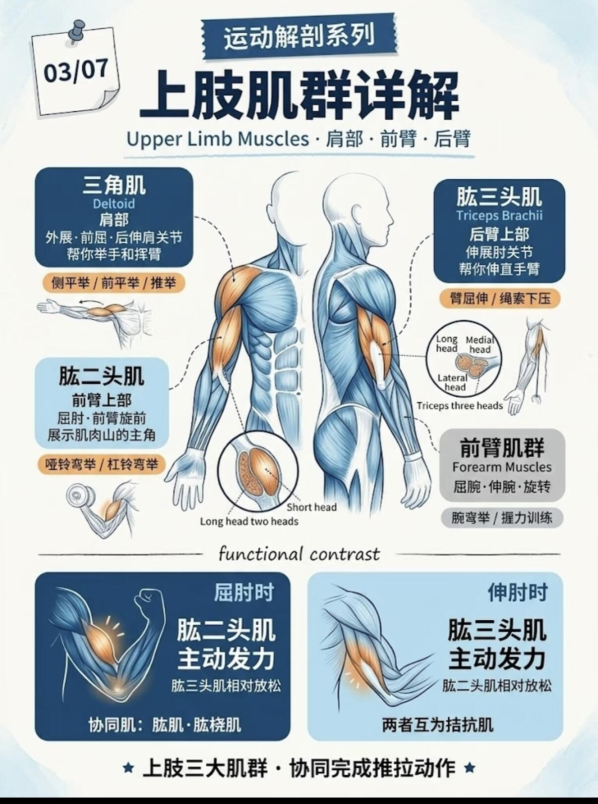
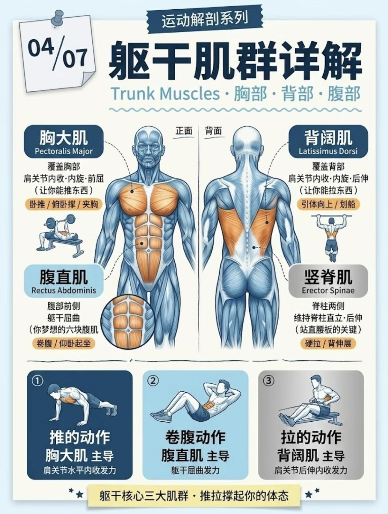
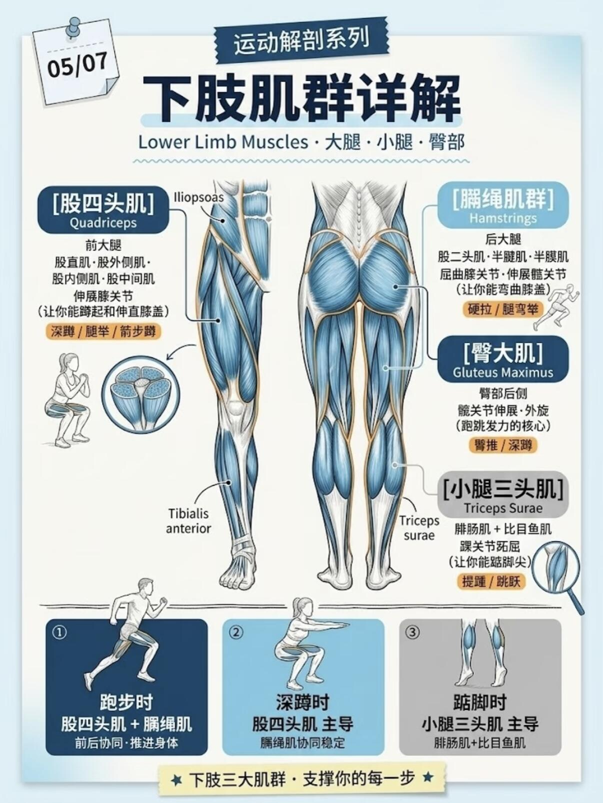
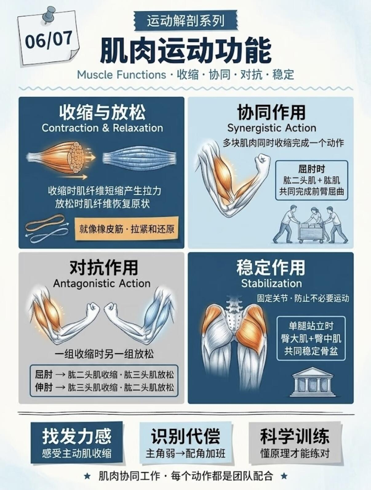
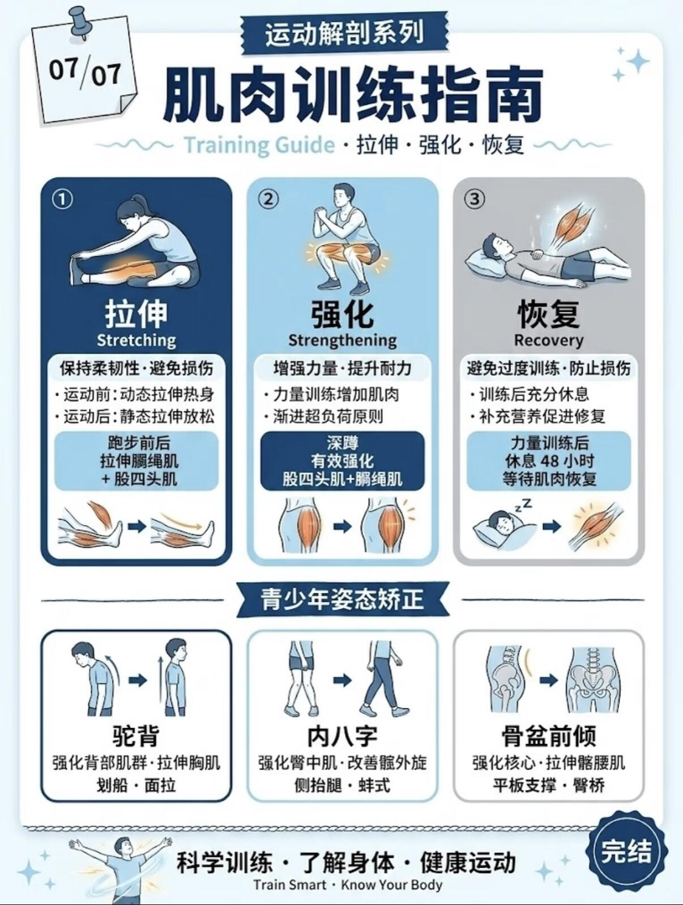

## 一图看懂全身肌肉

## 锻炼肌肉是高质量人生的必修课

人体肌肉随年龄增长发生结构和功能性退化，30-40岁达到峰值后，肌肉质量以每10年约3%-8%的速度递减，40岁后加速，50-60岁后每年递减1%-2%，70岁后流失显著，导致力量下降、代谢减慢及肌少症风险

健康是人生一切意义的**唯一载体**，而肌肉是维持身体健康的核心硬件：

1. **代谢与慢病防御**：肌肉是人体最大的代谢器官，肌肉量直接决定基础代谢率。充足的肌肉能高效消耗血糖、血脂，大幅降低 2 型糖尿病、高血压、高血脂等代谢类慢病的发病风险，从根源减少疾病对人生的消耗。
2. **骨骼与运动保护**：肌肉是骨骼的 “天然护具”，强健的肌肉能稳定关节、缓冲外力冲击，预防中老年骨质疏松、骨折、腰颈劳损，避免因身体损伤丧失行动自由。
3. **对抗衰老的核心筹码**：30 岁后人体肌肉量每年自然流失，肌少症是老年失能、生活质量崩塌的主要诱因。主动投资肌肉，就是提前储备「抗衰资本」，延长**健康寿命**（而非单纯生存寿命），让人生后半程依然拥有独立生活、体验世界的能力。

年轻时打下的肌肉基础，中年只需低强度维持即可保有量能，老年的肌肉储备会直接决定生活自理能力、抗病能力。**肉身是体验世间一切美好的唯一容器**，爱护身体、投资肌肉，是对生命最本质的敬畏与负责。