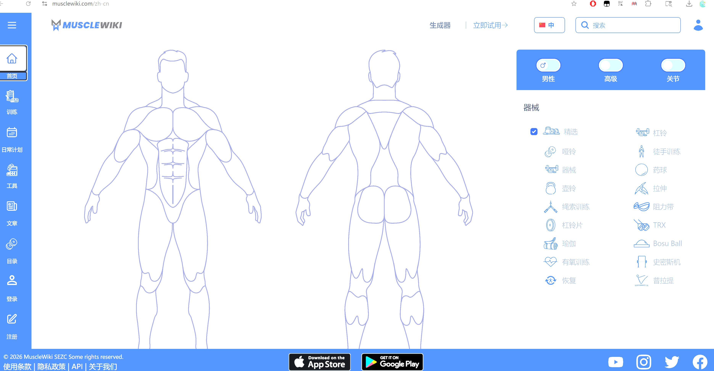

## 1. 手机端APP

有一个简单易懂又有系统化训练的APP可以事半功倍。手机端推荐“训记”。

使用一周下来，对该APP爱不释手。训记APP需要购买会员（买断制88元），不需要续费订阅。包含了训练计划、训练讲解、统计对比、饮食记录等功能。训练计划可以高度自定义，也可以使用官网预设的训练组合。

结合我自身的需求，我选择了官方计划-上下二分化训练，官方制作了[视频介绍](https://www.bilibili.com/video/BV1mt4y1g7v7/?spm_id_from=333.999.0.0&vd_source=df3065b1c93897e7fefbef39806ba46c)，具体要点包括：

- 二分化把身体区分为“躯干”和“肩腿”
- 第一阶段：一周四练，两分化各训练两次，训练5-6个月；第二阶段：一周五练，添加一个部位的增强训练。
- 配合饮食。

如果想选择适合自己的训练计划，可以查看训记作者的微信公众号文章-[训记APP的计划选择与说明](https://mp.weixin.qq.com/s/rFA2TLSQixzMj4oTqAPDqg)。

## 2. 网页-肌肉维基

访问地址：[https://musclewiki.com/zh-cn](https://musclewiki.com/zh-cn)

## 3. 居家训练基础装备：杠铃、哑铃组合

对于我选择的训练计划，训记APP给出了三个训练版本，分别为健身房、杠铃-哑铃组合、哑铃。其中杠铃-哑铃组合的效果竟然约等于健身房，那自然选择该版本，非常契合我想在家训练的想法。

一套迪卡侬的杠铃+哑铃组合，再来一台哑铃凳，装备就齐全了！这套迪卡侬的官方售价1900+，但是遇到了有缘分的同行，购入二手价格非常巴适。收到货后，用料非常扎实，快拆设计也很便捷。

