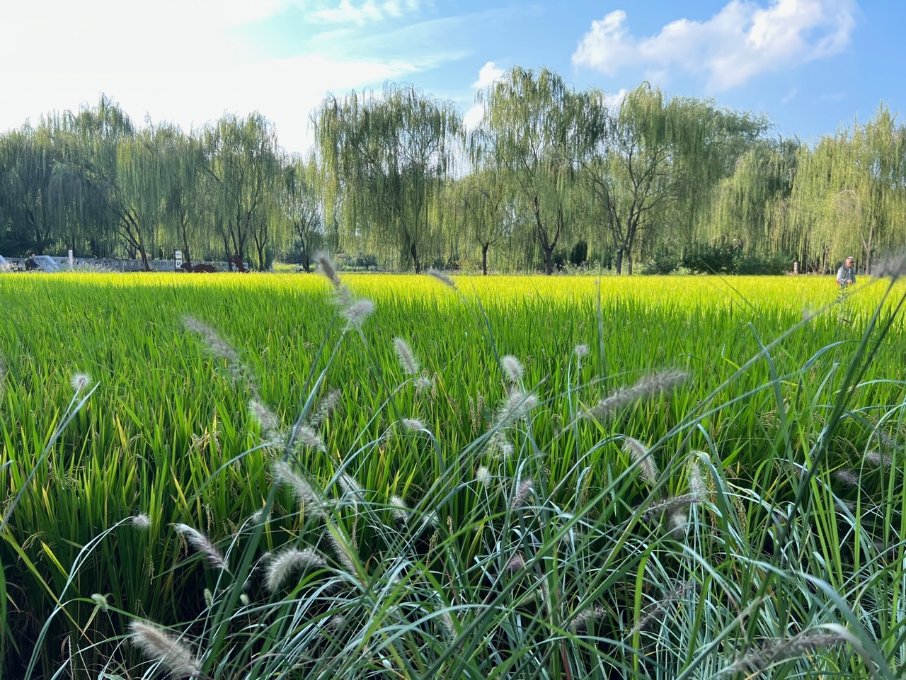
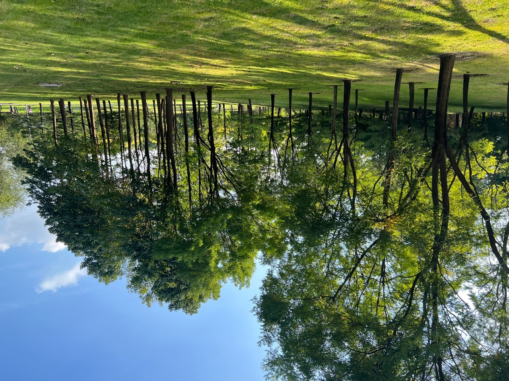
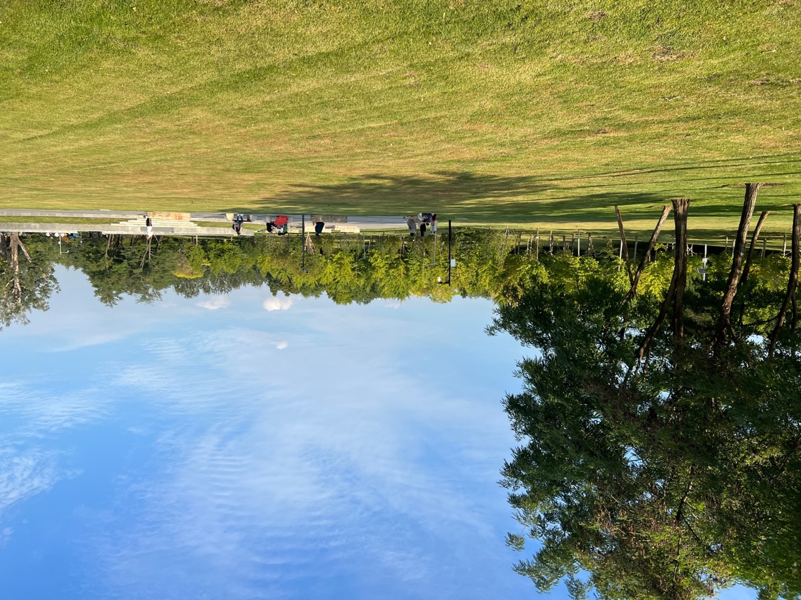

9月末，北京已经进入了秋天，一早一晚的风凉飕飕的。在一个多云转晴的周末，驱车来到北坞公园，留下了深刻的印象。北坞公园，承载我关于公园的所有幻想。

## 大片的金色水稻田

从南门进入，映入眼帘的是大片的**水稻田**，西斜的阳光洒下来，黄灿灿的，带来巨大的视觉冲击力。

置身于水稻田中，渺小、开阔、豁亮，顺着田垄走过，手指轻拂稻穗🌾，脑海里想的是哲学：“人生就像走过一片不能折返的麦田，要选出最大的一穗”，还有“小麦覆陇黄”的诗意。

稻穗很精致，大自然赋予他们锋利的叶子、饱满的颗粒，也赋予了他们在生态系统中的角色。无论是拥有精致大脑的人类，还是矫健身手的猎豹；无论是生产者还是消费者，都公平的享有自然的鬼斧神工。

## 阳光透过整齐树林

穿过稻田，又映入眼帘的，是阳光穿过的密林。整齐的树，矗立在整齐的草地上，端庄而又美丽。

下午四点的阳光刚刚好，从西面穿越树林，斑驳的光影洒落，带来明暗交错的立体感，焕发生机。我一眼便相中的这个地方，压抑在心中的阴霾一扫而光，十分养眼。

## 大草坪

怎么能拒绝公园的大草坪呢？

整齐的草坪，慵懒的步调，闲适的人群。漫步在其中。此行奔波数十里，遇到喜欢的草地，可惜不让踩踏、更不要说立起帐篷，巡回的保安骑着电驴盯着我手上的营地车，十分警惕。

## 结语

何谓天时地利？天时：在多日的阴霾后绽放的秋日暖阳，是北京城天高气爽的初秋。地利：美丽的北坞公园。一起造就了一个美妙的周末下午。希望我不会遗忘此刻的感动与喜悦。

2023年秋