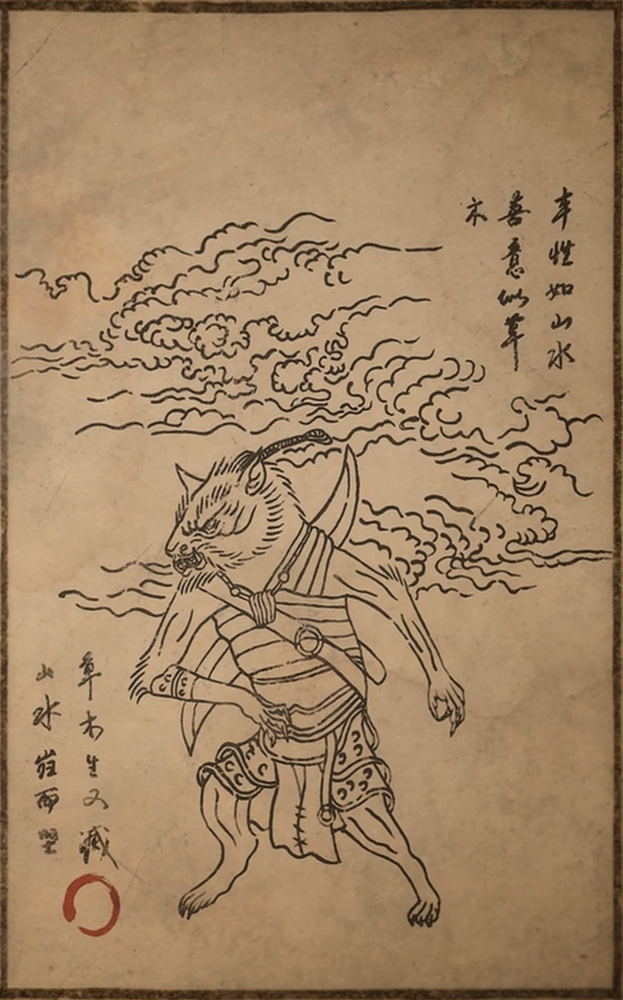

黑神话悟空里有这样一则故事：

黑风山里一小狼，小狼随大苍狼学习捕猎，他聪明勤勉，却总也捉不到食物。这日，大苍狼下令让小狼独自觅食，否则就得挨饿。小狼返回山场，潜在暗处，不久就逮到了只兔子。不想，那小狼并未立刻扑食，反倒小心翼翼地收敛着气力，帮兔子舔伤止血。

兔子见状，挣扎着逃脱了，小狼又疾奔去追。兔子慌不择路，跌入塘中，它扑腾着想游回岸上，却被追来的小狼一爪摁回水中。须臾，眼瞧兔子就要溺死，小狼又急急将其捞起，不断轻蹭它的脑袋，帮它缓过气来。兔子醒转，正不明所以，暗处忽传来大苍狼的呼嚎，小狼张皇失措，伸爪按住兔子，可用力太甚，只听咔嚓一响，抬爪再看，兔子已七窍喷红，死透了。

小狼伤心地啜泣不已，大苍狼上前一问，这才明白：原是小狼不忍杀兔子，所以屡次饶它性命，可又担心自己挨饿，始终也不愿放过它。听罢，大苍狼道：“你以为自己心慈手软，其实给自己和兔子都平添许多苦痛，思前想后，翻来覆去，倒不如从开始，就给彼此一个痛快。”

小狼似是从这话中悟出别番道理，后来他自创了一手扔镖暗杀的把式，又快又狠，自认这是给对手最大的仁慈。

> 正可谓：
>
> 本性如山水，善意似草木。
>
> 草木生又灭，山水岿而坚。

这个故事可以从多个角度理解：

**角度1:** 如果不改变本性，短暂的改变只会带来反复的伤害。

**角度2:** 古人有云，慈不掌兵、义不养财、善不为官、情不立事、仁不从政。引申来看，仁慈、善良、义气，在某些情形下，反而是不可取的。