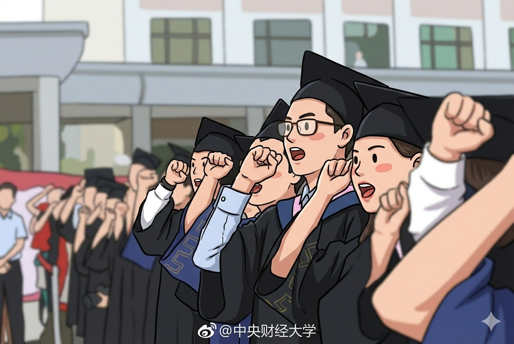

2025年的盛夏，又是一年毕业季。作为2020年6月毕业的老人，弹指间已经走出校门五年了。看到导师群里毕业晚会邀约、看到公众号上青春洋溢毕业照，能感受到那种氛围和喜悦就在昨天，但照照镜子沧桑的我、双腿扎在格子间工位的我，却又是实打实的中年男子。

是什么偷走了我的五年？

最大的小偷是疫情的管制，整整偷掉了3年的时光。失去了2020年6月的毕业季和旅行；长时间的居家办公和隔离，也失去了无数个周末和假期。在口罩的统治下，生活方式完全被改变，探索世界的脚步被强行按下暂停，任凭时光流逝而无所获。

第二个小偷是康波周期，打破了未来向上的憧憬。在工作后的5年里，房地产市场从2020年的初显颓势，到2021年的波峰，再到2022年-2025年的急速下滑；除了房价外，全行业、全链条的下行周期，人均收入下降、消费降级；对我个人而言，则是金融行业的降薪、限薪，以及行业收缩下的职位收缩，“苟住”成为工作的常态，多做就会多错，但如果躺平，那就是一眼就能看到退休生活的乏味。

一寸光阴一寸金，寸金难买寸光阴。只能劝自己放平心态，珍惜当下；虽然绝大多数人嘴上说着珍惜当下，但又有谁不想回到朝气蓬勃、对未来充满憧憬的青葱岁月呢？

