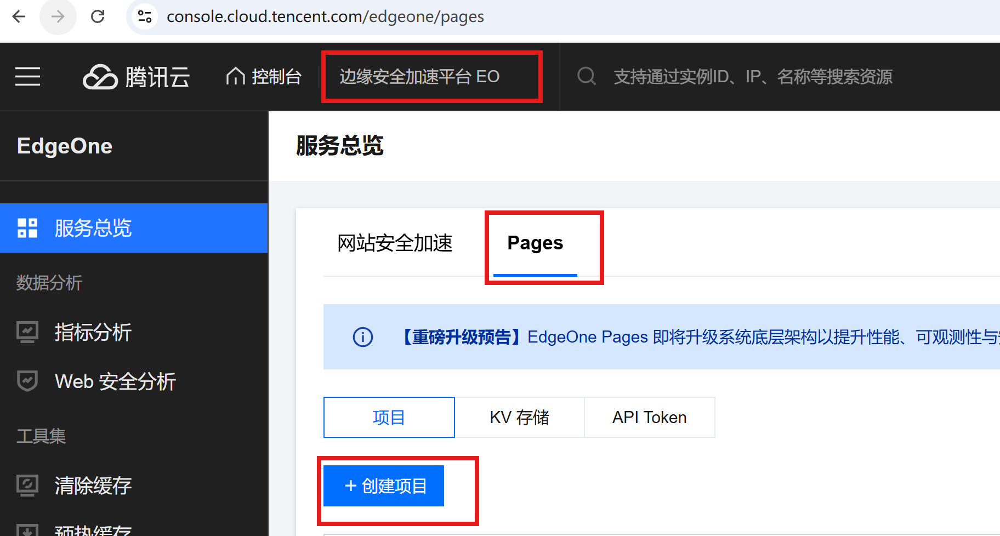

本教程以自用为主，使用的是基于Vuepress的plume主题。预览网站：[yunriver.com](https://yunriver.com)

## 本地安装

安装教程详见[官方文档](https://theme-plume.vuejs.press/guide/usage/)，以pnpm为例，在本地运行以下命令：

```bash
pnpm create vuepress-theme-plume@latest
```

本地调试：

```
pnpm run docs:dev
```


## 设立专题/集合

plume主题支持集合的概念，即一个项目下可以有多个子文档库，子文档库之间使用独立的导航栏。

集合有两种类型，分别是post类型和doc类型。post类型实现博客功能，doc类型实现文档库功能、带有侧边栏。

打开 `.vuepress/collections.ts` 文件，以设置“生活记”、“投资记”、“健康记”三个专题为例，修改代码如下：

```
import { defineCollection, defineCollections } from 'vuepress-theme-plume'

//const blog = defineCollection({
  // post 类型，这里用于实现 博客功能
  //type: 'post',
  // 文档集合所在目录，相对于 `docs`
  //dir: 'blog',
  // 文档标题，它将用于在页面的面包屑导航中显示
  //title: 'Blog',
  // 文章列表页的链接，如果 `linkPrefix` 未定义，它也将作为 相关的文章的 //permalink 的前缀
  //link: '/blog/',
  //   linkPrefix: '/article/', // 相关文章的链接前缀
  //   postList: true, // 是否启用文章列表页
  //   tags: true, // 是否启用标签页
  //   archives: true, // 是否启用归档页
  //   categories: true, // 是否启用分类页
  //   postCover: 'right', // 文章封面位置
  //   pagination: 15, // 每页显示文章数量
//})

const lifeDoc = defineCollection({
  // doc 类型，该类型带有侧边栏
  type: 'doc',
  // 文档集合所在目录，相对于 `docs`
  dir: 'lifedoc',
  // `dir` 所指向的目录中的所有 markdown 文件，其 permalink 需要以 `linkPrefix` 配置作为前缀
  // 如果 前缀不一致，则无法生成侧边栏。
  // 所以请确保  markdown 文件的 permalink 都以 `linkPrefix` 开头
  linkPrefix: '/lifedoc',
  // 文档标题，它将用于在页面的面包屑导航中显示
  title: '生活记',
  // 手动配置侧边栏结构
  //sidebar: ['', 'foo', 'bar'],
  // 根据文件结构自动生成侧边栏
  sidebar: 'auto',
})

const investDoc = defineCollection({
  // doc 类型，该类型带有侧边栏
  type: 'doc',
  // 文档集合所在目录，相对于 `docs`
  dir: 'invest',
  // `dir` 所指向的目录中的所有 markdown 文件，其 permalink 需要以 `linkPrefix` 配置作为前缀
  // 如果 前缀不一致，则无法生成侧边栏。
  // 所以请确保  markdown 文件的 permalink 都以 `linkPrefix` 开头
  linkPrefix: '/invest',
  // 文档标题，它将用于在页面的面包屑导航中显示
  title: '投资记',
  // 手动配置侧边栏结构
  //sidebar: ['', 'foo', 'bar'],
  // 根据文件结构自动生成侧边栏
  sidebar: 'auto',
})

const health = defineCollection({
  // doc 类型，该类型带有侧边栏
  type: 'doc',
  // 文档集合所在目录，相对于 `docs`
  dir: 'health',
  // `dir` 所指向的目录中的所有 markdown 文件，其 permalink 需要以 `linkPrefix` 配置作为前缀
  // 如果 前缀不一致，则无法生成侧边栏。
  // 所以请确保  markdown 文件的 permalink 都以 `linkPrefix` 开头
  linkPrefix: '/health',
  // 文档标题，它将用于在页面的面包屑导航中显示
  title: '健身记',
  // 手动配置侧边栏结构
  //sidebar: ['', 'foo', 'bar'],
  // 根据文件结构自动生成侧边栏
  sidebar: 'auto',
})

/**
 * 导出所有的 collections
 * (blog 为博客示例，如果不需要博客功能，请删除)
 * (demoDoc 为参考示例，如果不需要它，请删除)
 */
export default defineCollections([

//blog
lifeDoc,
investDoc,
health,
])


```

上述三个专题的对应访问页面分别是

`https://你的域名/lifedoc`

`https://你的域名/invest`

`https://你的域名/health`

## 个性化配置

打开 `.vuepress/config.ts` 文件，取消对应功能的注释，实现主题的各类功能，包括：自动添加 frontmatter 配置、启用嵌入 bilibili视频 语法 @[bilibili](bid)、启用数学公式、启用图片懒加载等功能。

## 内容写作

在部署之后，后续只需要使用Typora等Markdown编辑器，撰写文档内容，专注写作。

markdown文件存放在/docs目录下的对应专题文件夹，图片可以通过Typora的自动复制图片至指定目录的功能，全部存放于docs/.vuepress/public目录下，集中统一管理。

markdown文件的YAML参考如下：

```
title: 文章标题
createTime: 2026/03/11 10:53:30
permalink: /专题名字/xx/xxxx/
```

文档结构如下：

```
├── docs
│   ├── 专题1
│   │   ├── 示例1.md
│   │   └── 示例2.md
│   ├── 专题2
│   │   ├── 示例3.md
│   └── README.md
```


## 托管至GitHub仓库

通过Github Desktop或者其他Git工具，将本地文件PUSH到Github的仓库中。


## 部署到腾讯云EdgeOne

对于备案域名，使用腾讯云EdgeOne部署能够带来不错的访问体验。



选择导入Git仓库。

构建设置填写如下方案：

```
框架预设 Other

根目录 ./

输出目录 docs/.vuepress/dist

编译命令 npm run docs:build

安装命令 npm install
```

开始部署即可。


## 可选：接入Waline评论

在VUEPRESS根目录安装Waline前端，运行如下命令：

```
pnpm add -D @waline/client
```

再打开 `.vuepress/config.ts` 文件，在 `plumeTheme` 的配置对象中加入 `plugins.comment` 模块。

```
import { defineUserConfig } from 'vuepress'
import { plumeTheme } from 'vuepress-theme-plume'

export default defineUserConfig({
  theme: plumeTheme({
    // 其他的主题配置...
    
    plugins: {
      comment: {
        provider: 'Waline', // 指定服务提供商为 Waline
        comment: true, // 全局默认开启评论
        serverURL: 'https://你的Waline后端地址', // 填写你现有的 Waline 后端 URL
        
        // 以下是 Waline 的可选扩展配置：
        // dark: 'html.dark', // 适配 Plume 主题的夜间模式
        // emoji: ['https://unpkg.com/@waline/emojis@1.1.0/weibo'], // 自定义表情包
      }
    }
  })
})
```


