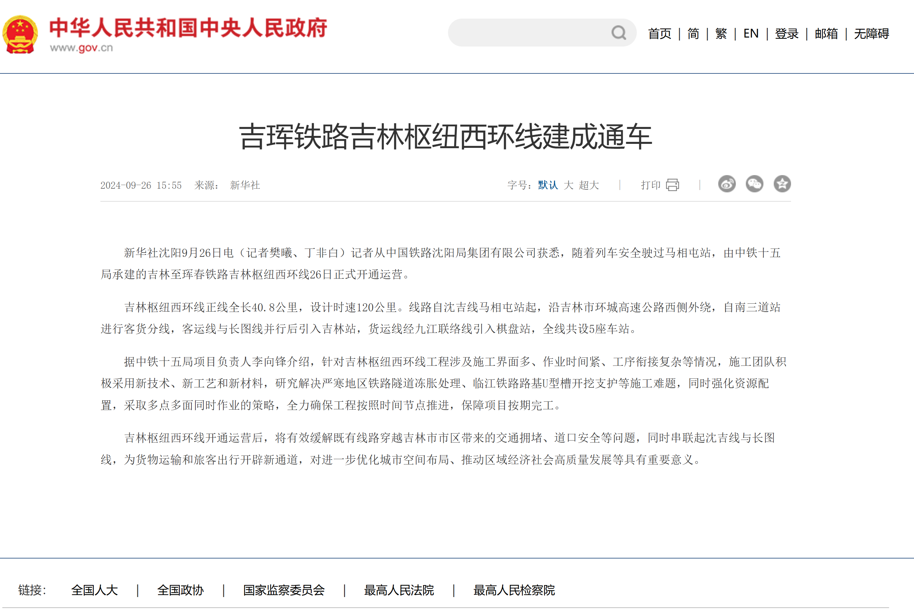

你是县里的老爷，新上马的工程对你很重要，从省里都很重视。但是工程迟迟无法开工，因为钉子户张三狮子大开口，县里又很穷，一直拖着。上周省里又打来电话了，问能不能按期竣工，没有能力就不要干了。你只能发了一纸通告给张三——最后通牒，就按标准给钱，没有协商的余地，并当即找人把他的猪圈强拆了。但是张三这个刁民，不仅现场闹事，还把强拆的问题向市里行政复议，市里打电话给你了，市里不会帮你擦屁股，你的行为就是违法强拆，三天之后就得答复张三了，让你自己想办法赶紧处理。

## 公安局拘留阶段30天

接了市里的电话，你心里暗自咒骂，市里这些既要还要的孙子，拆迁费我县里出，刺头我自己摆平，还站在旁边装正义，这个工程干不下去，市长的日子也不好过！

这时工地又传来消息，张三又带着老婆孩子在工地闹事，你叫上县公安局长去现场，当即对张三刑事拘留，你说罪名是什么？就先扣一个涉嫌破坏生产经营罪。公安局能拘留3天时间（特殊情况可以延长 1 - 4 天），先安生3天吧。

3天之后，市里的复议结果正式发给了张三——认定县里属于强拆。你继续骂娘，这个时候可不能把张三放出来，给公安局长打电话，电话那头点头哈腰：老爷您别着急，“流窜作案、多次作案、结伙作案的重大嫌疑分子”，可以拘留30天！ 那就这么办吧！

> 公安机关对被拘留的人，认为需要逮捕的，应当在拘留后的三日以内，提请人民检察院审查批准。
> 对于流窜作案、多次作案、结伙作案的重大嫌疑分子，提请审查批准的时间可以延长至三十日。

## 公安局逮捕阶段7+60天

为了避免公安局一家独大，拘留期过了，公安局需要报检察院“批准逮捕”，检察院有7天时间检查批准。但是这可约束不了你，公安局、检察院，不都是你手下的兵嘛。于是你一个电话打过去，检察院的同志很客气，也非常配合你的工作，于是拖到第7天才做出批准逮捕的决定。

得到检察院的授权，公安局就可以继续对张三实施控制——逮捕2个月。

> 人民检察院应当自接到公安机关提请批准逮捕书后的七日以内，作出批准逮捕或者不批准逮捕的决定。
>
> 对犯罪嫌疑人逮捕后的侦查羁押期限不得超过二个月。

## 移交检察院45天

经过公安局97天的侦察，充分掌握了张三的涉嫌犯罪的证据，因此移交至检察院，由检察院在一个月内决定是否公诉。检察院听完你的诉苦，谄媚地说：张三就是刁民，应该给点颜色，多次闹事属于重大、复杂的案件。因此成功拖了45天。

> 人民检察院对于监察机关、公安机关移送起诉的案件，应当在一个月以内作出决定，重大、复杂的案件，可以延长十五日；

## 提起公诉、等待人民法院开庭

最后，检察院终于提起公诉了，这个时候要等待法院开庭。没办法，客观原因，就让张三再等等吧。

## 人民法院审理90+30+90天

法律规定，人民法院审理公诉案件，2个月就得宣判，最迟不能超过3个月。你觉得3个月时间太短了，一个电话打过去，这个案件太复杂，退回补充侦查吧！

> 第二百零八条　人民法院审理公诉案件，应当在受理后二个月以内宣判，至迟不得超过三个月。

补充侦察时间是多久呢？30天。

> 人民检察院应当在一个月以内补充侦查完毕。

30天之后怎么办呢？别害怕，法院的审理时间刷新了！又来3个月！

> 人民检察院补充侦查的案件，补充侦查完毕移送人民法院后，人民法院重新计算审理期限。

最后怎么办，实在是没罪，那就让检察院的同志辛苦一下，在最后一天撤诉吧！检察院作出《撤回起诉决定书》，以没有犯罪事实为由要求撤回起诉。法院的同志一看不用自己背锅了，立即作出的《刑事裁定书》，该院认为，区检察院以没有犯罪事实为由撤回起诉，符合法律规定，应予准许！张三可以回家了！

## 无罪释放，国家补偿

国家补偿的标准很低，而且也是纳税人出钱。比张三狮子大开口要的拆迁款划算多啦！

不算等待法院开庭的时间，一共羁押了张三352天！

而你，伟大的县老爷，已经完成了工程的建设，顺利获得了嘉奖，工程通车的那一天，还上了央视头条！

新闻链接：[吉林一男子被控破坏生产经营遭羁押295天：检方撤诉，已申请国赔](https://www.thepaper.cn/newsDetail_forward_31395695)