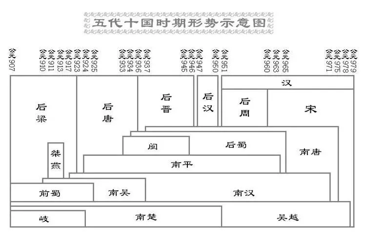
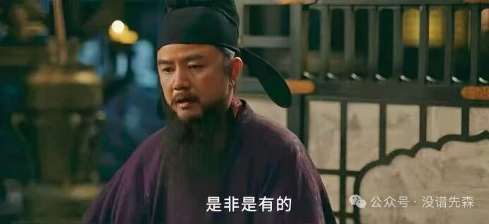
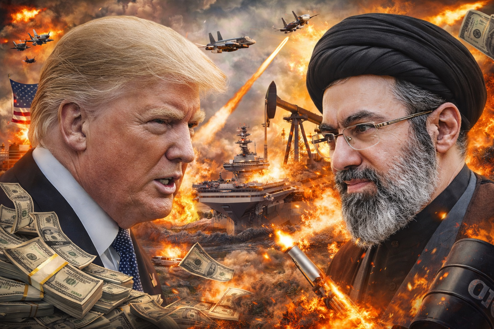

在最近在看电视剧《太平年》，为了看弹幕特意开了一个月爱奇艺的TV会员。弹幕上一直有历史知识的网友科普，能够帮助我这个**历史盲**理解剧情。不然是真的看不明白。

对于我而言，通过《太平年》这部电视剧，是第一次了解到了五代十国的存在，之前在历史课本里可能一笔带过的内容，对于当时的人民，就是沉重的乱世。

弹幕也时不时地吵起来，甚至批评导演把某个人物洗白了，针对历史上的不同的人物的事件，大家的看法各不相同，而且各种史料记载的也各不相同。例如对于冯唐的评判，对于赵匡胤之死“烛光斧影”的解读等等。通过弹幕的交流，兼听则明，窥探到了历史人物的多面性。

回想到上学时学的历史课本，那时候的历史课本上的结论明确的，很少有争议性的表述。现在看来，历史教科书上讲的也并不是历史事实，仅仅是一种观点。

电视剧反映的是导演的意志，教科书由于其教育和凝聚共识的功能属性，往往呈现的是一种经过政治审查的“主流观点”，不可避免地带有编写者以及政治的烙印。

事实重要吗？重要也不重要，重要是因为历史总要分出是与非。

不重要是因为，历史总归是主观的。即便是正在发生的大事件，站在国家的立场、政党的立场、个人的立场，大家的观点也各自不同。

因此，我们要清醒地认识到，不管是教科书，还是电视剧，还是某一份言之凿凿的史料，都只能称之为历史的观点，而不能称之为事实。我们在凝视历史这面镜子时，投射进去的其实是我们当下的立场、需求以及自身的认知结构。历史之所以能“使人明鉴”，不在于它提供了一个绝对客观的标准答案，而在于它提供了一个跨越时空的庞大参照系，允许人们从各自的角度去拆解、反思，并提取属于自己的智慧。

## 拓展阅读

[知乎-历史教科书上的哪些观点其实是有争议的？](https://www.zhihu.com/question/61373111/answer/1969735501490659361?share_code=QWuxUS5slSuJ&utm_psn=2026251430692923162)