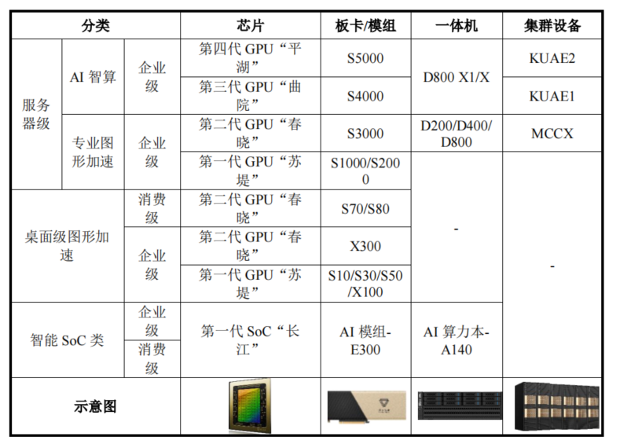
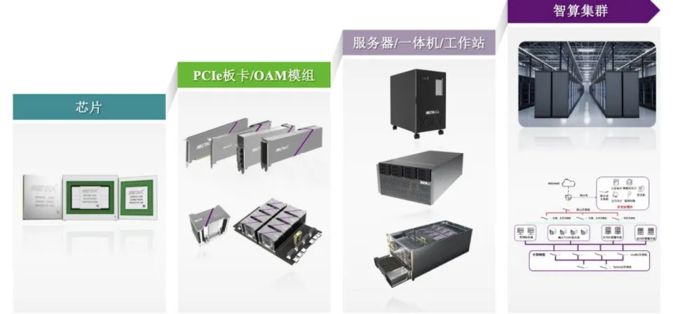
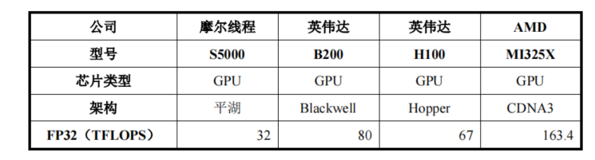
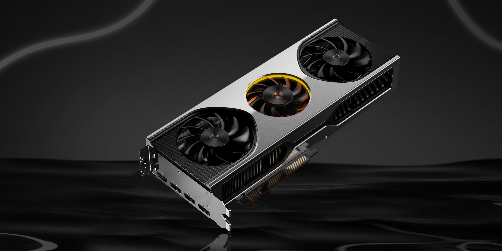
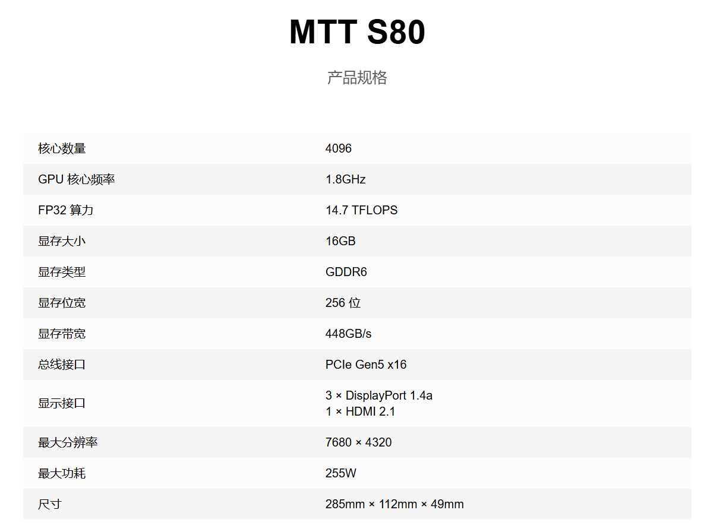
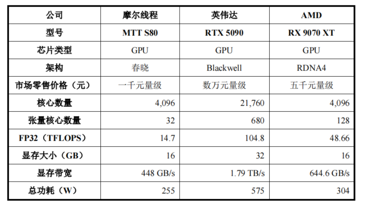
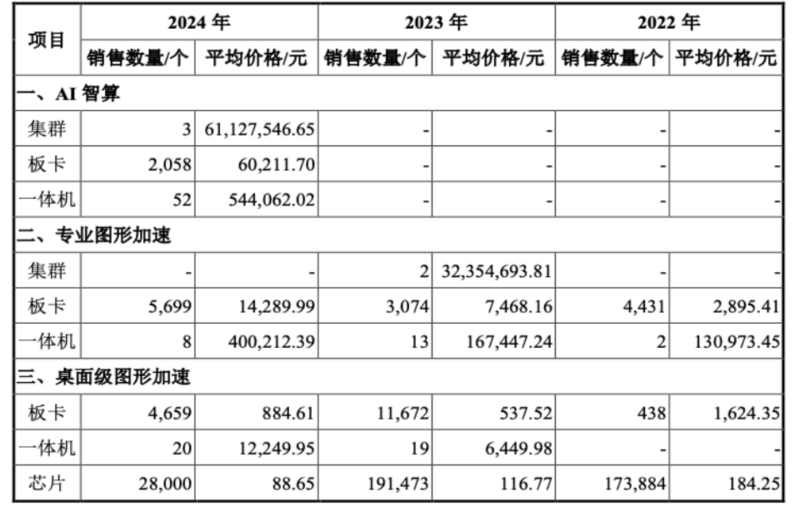

> 摩尔线程的数据中心卡旗舰产品为 S5000，单从 FP32 精度的算力的角度，摩尔线程 S5000 约为英伟达 H20（中国特供）的 70%，约为英伟达旗舰产品 B200 的 40%，因为缺少其他参数，无法做出综合比较。
>
> 桌面消费级卡旗舰产品为 S80，与英伟达 RTX3060 相当（价格也相当，均为 1500-2000 元之间）；通过横向对比旗舰产品，摩尔线程的消费级 GPU 旗舰产品 S80 相当于英伟达 2015 年的旗舰产品，即十年前的产品。通过对比现有的旗舰产品，英伟达消费级旗舰产品 RTX 5090 约是摩尔线程旗舰产品的 7 倍以上（FP32 精度算力），当然价格相差 15 倍以上。
>
> 结论是在国产替代、自主可控的帽子下，如果代工厂能够稳定合作，企业具备一定竞争力。

## **简况**

2020 年 10 月成立以来，公司一直采用 Fabless 经营模式，专注于全功能 GPU 芯片及相关产品的研发、设计和销售，将晶圆制造、封装测试、板卡加工等其余环节交由晶圆制造企业、封装测试企业及其他加工厂商完成。【未披露代工厂是谁，根据网络信息是中芯国际14nm/7nm工艺】

根据 IPO 说明书，摩尔线程在国内 GPU 领域处于领先地位，基于自主研发的 MUSA 架构（注：摩尔线程走的兼容路线，其架构兼容英伟达的 CUDA）。公司于 2023 年 10 月被美国列入“实体清单”，对公司采购美国生产原材料、 采购或使用含有美国技术的知识产权和研发工具等产生一定限制。

财务简况：持续亏损，2022-2024 年，发行人累计研发投入为 38.10 亿元。（作为对比，寒武纪的近三年研发投入 38.57 亿元，英伟达近三年为 271.81 亿美元）

## **7 名高管情况**

**张建中先生**，摩尔线程创始人、董事长、总经理，中国国籍，硕士研究生学历，高级工程师。1990 年 5 月至 1992 年 3 月，于冶金自动化研究设计院国家计算机实验室部门任高级研究员；1992 年 4 月至 2001 年 5 月，于中国惠普有限公司 1 任产品总经理；2001 年 6 月至 2006 年 3 月，于戴尔（中国）有限公司全球客户部任总经理；2006 年 4 月至 2020 年 9 月，于英伟达任全球副总裁，大中华区总经理；2020 年 10 月摩尔线程开始运营后，以实控人身份参与公司经营管理，2023 年 11 月至今任摩尔线程总经理，2023 年 12 月至今任摩尔线程董事长。

**薛岩松先生**，男，1973 年 6 月出生，摩尔线程董事会秘书及财务负责人。简历略。

**张钰勃先生**，摩尔线程联合创始人、董事、副总经理，中国国籍，博士研究生学历。2013 年 10 月至 2017 年 11 月，于英伟达任 GPU 架构师；2017 年 11 月至 2020 年 9 月，于 Pony AI Inc.基础架构部门任主任工程师；2020 年联合创立摩尔线程，历任摩尔线程监事、董事、副总经理。

**杨上山先生，**摩尔线程副总经理，中国国籍，硕士研究生学历。2009 年 4 月至 2011 年 1 月，于上海贝尔阿尔卡特股份有限公司任软件工程师；2011 年 1 月至 2012 年 4 月，于爱立信（中国）通信有限公司任软件工程师；2012 年 4 月至 2020 年 10 月，于英伟达任 GPU 架构师；2020 年 10 月至今，任摩尔线程软件研发部总经理；2024 年 12 月至今，任摩尔线程副总经理。

**王东先生**，摩尔线程联合创始人、副总经理，中国国籍，本科学历。1999 年 7 月至 2000 年 5 月，于北京市晓林科贸公司任销售副总；2000 年 6 月至 2001 年 2 月，于北京硅谷动力电子商务有限公司任产品经理；2001 年 5 月至 2004 年 5 月，于英迈国际贸易（上海）有限公司任产品总监；2004 年 6 月至 2007 年 9 月，于精英电脑股份有限公司任销售总监；2007 年 10 月至 2019 年 3 月，于英伟达任销售总监；2020 年联合创立摩尔线程，历任摩尔线程监事、董事会秘书、副总经理。

**宋学军先生**，摩尔线程副总经理，中国国籍，本科学历。2004 年 10 月至 2011 年 5 月，于英伟达任高级销售经理；2012 年 5 月至 2013 年 1 月，于智祥科技中国香港有限公司任副总经理；2013 年 1 月至 2014 年 6 月，于联芯科技有限公司任产品开发技术负责人；2014 年 6 月至 2017 年 4 月，于忆正科技股份有限公司任中国区销售总经理；2017 年 4 月至 2019 年 5 月，于晶兆创新股份有限公司任协理；2019 年 5 月至 2020 年 7 月，于湖南国科微电子股份有限公司任高级销售总监；2020 年 10 月至今，任摩尔线程战略合作部总经理；2024 年 12 月至今，任摩尔线程副总经理。

**常玉保先生**，摩尔线程副总经理，中国国籍，硕士研究生学历。2007 年 1 月至 2011 年 2 月，于北京中星微电子有限公司任芯片验证工程师；2011 年 2 月至 2018 年 8 月，于北京楷登信息技术有限公司任资深技术支持经理；2018 年 9 月至 2020 年 7 月，于北京智云芯科技有限公司任 CTO；2020 年 10 月至今，任摩尔线程芯片验证部总经理；2024 年 12 月至今，任摩尔线程副总经理。

7 名高管中，除掉董秘/财务负责人，剩余 6 人中，技术背景 3 人，销售背景 3 人。且从履历上看，英伟达前员工的含量很高。

‍

## **产品一览**

根据募集说明书，企业的产品主要是 GPU 产品，根据应用场景（纵轴）和集成程度（横轴）可以划分如下：

根据上图，我们可以清晰的看到，摩尔线程的 GPU 已经迭代了四代，其中消费级使用二代，AI 智算使用四代芯片。围绕芯片核心，拓展了板卡、一体机/服务器、集群设备三种形态，如下图（示意图，与摩尔线程无关）

## **和英伟达掰一掰手腕**

募集说明书没有披露具体参数。从官网找了一些产品参数，看一看和英伟达能不能掰一掰手腕：

### **1.数据中心卡**

MTT S5000：根据募集说明书，摩尔线程已经迭代出了第四代芯片，并打造了 S5000 板卡产品。其 32 位浮点运算的算力达到了 32TFLOPS (Tera Floating point number operations per second) 每秒处理浮点数的 **32 万亿**次数。英伟达的旗舰产品 B200 同等精度下为 80TFLOPS，H100 是 67TFLOPS，中国特供 H20 在同等精度的算力是 44TFLOPS。

如此看来，单从算力的角度，摩尔线程 S5000 约为 H20（中国特供）的 70%，约为旗舰产品 B200 的 40%。因为缺少其他参数，无法做出综合比较。

### **2.家用消费级卡**

游戏 MTTS80 京东售价 1499 元。官方宣称其性能规格与英伟达 RTX 3060 相当。公司推出的国内首款支持 Windows 操作系统以及 DirectX 11/12 图形计算库的消费级显卡。

根据网络信息，RTX3060 于 2021 年上市，目前京东售价 1899 元，在数据可比参数上确实接近，具体如下表：

| **参数**       | **GeForce RTX 3060**              |
| -------------- | --------------------------------- |
| 显卡架构       | Ampere                            |
| 显卡芯片       | GeForce RTX 3060                  |
| CUDA 核心数    | 3584 个                           |
| 显存容量       | 12GB GDDR6                        |
| 显存位宽       | 192-bit                           |
| 显存速度       | 15 Gbps (可变)                    |
| 核心频率       | 1320 MHz (基础) / 1780 MHz (加速) |
| 总线接口       | PCI Express 4.0                   |
| OpenGL         | 4.6                               |
| 最大数字分辨率 | 7680 x 4320                       |
| 推荐电源       | 550W                              |

‍

鉴于 RTX3060 不是英伟达的旗舰产品，我们去找 RTX3060 相当于英伟达哪一代系的旗舰性能，根据显卡[天梯榜](https://www.mydrivers.com/zhuanti/tianti/gpu/index.html)，GTX 3060 介于 Geforce900（2014 年推出）和 Geforce10 代（2016 年推出）的旗舰产品之间，因此可以理解为摩尔线程的消费级 GPU 旗舰产品 MTT S80 相当于英伟达 2015 年的旗舰产品，即十年前的产品。

另一种对比方式是，对比现有的英伟达桌面消费级旗舰“RTX 5090 和 5090D / 5090D v2 ”，英伟达当下的消费级旗舰产品 RTX 5090D 约是摩尔线程旗舰产品的 7 倍以上（FP32 精度算力）。当然，英伟达 RTX 5090D 的价格达到了 29000 元，是英伟达 RTX3060/摩尔线程 MTT S80 现价的 15 倍。

## **市场销量**

2022年至2024年，公司前五大客户销售额占比分别为89.86%、97.45%和98.16%，2025年上半年，公司第一大客户R贡献了期内56.63%的收入。客户集中度较高。

‍

‍