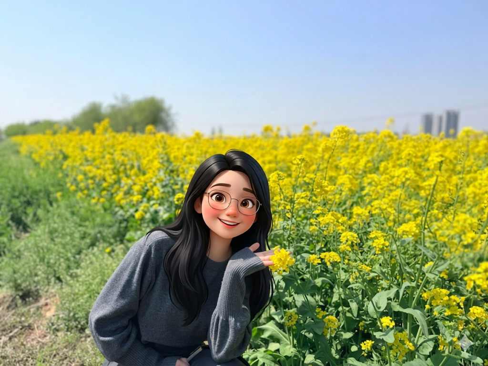
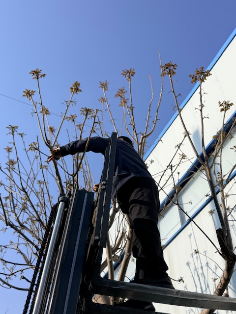
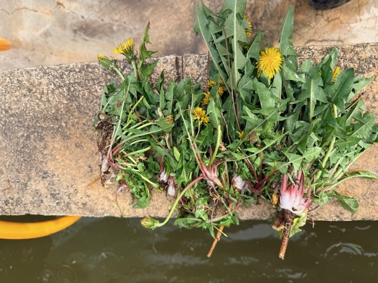
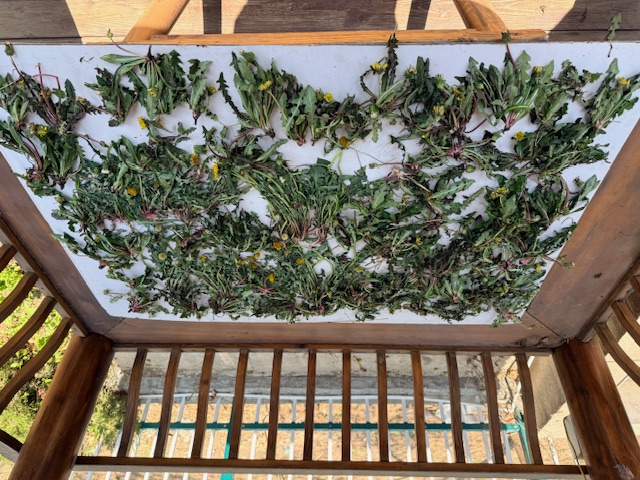
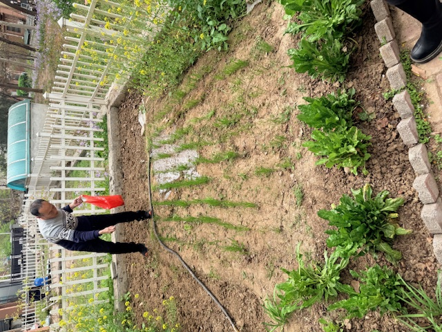

## 油菜花

清明节回家，乡野间竟然星罗棋布地绽开着油菜花，明亮的黄色煞是美丽；密集种植的地方甚至连成片、黄色的花海在明媚的春风下波涛阵阵。

它是农民重要的经济作物，但小时候并不常见。查询了一下Gemini，归纳为以下原因：

> **休耕轮作与养地：**  华北平原长期以“冬小麦-夏玉米”轮作模式为主，容易造成土壤肥力透支。引入油菜进行轮作，油菜的根系分泌物能溶解土壤中的难溶性磷，改善土壤理化性状。
>
> **优质油料作物：** 油菜本身是高产的经济作物。花期结束后，结出的菜籽可以用来榨取菜籽油，属于优质食用油。
>
> **品种改良：** 过去北方由于冬季严寒，不太适合种植越冬的油菜。但近年来，耐寒的北方冬油菜品种（如“白杂”系列等）得到推广。

油菜花虽美，但是只可远观、不可亵玩，主要原因是会弄脏衣服，很难洗掉。

## 香椿和蒲公英

春天的馈赠，非香椿莫属了。厂子里有一排整齐的香椿树，而且香椿树可以通过根系滋生小树，往往“一树落，万树生”，滋生出一排整齐的树苗。清明时节，正是香椿最嫩的时节，摘下后，便可以切碎、焯水、炒蛋，非常爽口嫩滑。

另外的馈赠就是蒲公英，它们开着鲜艳的小黄花，会使你不禁哼唱起JAY的“故事的小黄花”~

蒲公英是不太好找到的，一般的路边田野是没有的，但是找到之后就会发现一大群，往往10株以上。至于原因，同样请教了Gemini ，AI说蒲公英偏好特定的土壤环境，如果环境适合，就会通过**“母株打下江山——莲座叶守住地盘——深根系年复一年巩固——克隆种子就近繁衍”**这一套完美组合拳，建立起来小领地。

挖蒲公英是一项有成就感的事情，同时需要弯腰所以有些小累。下图是新鲜的刚采摘的蒲公英和晾晒过程：

## 狗、鸡和鹅

乡土气息，离不开小动物的加持。土狗是很聪明、接地气的人类伙伴。

妈妈在厂里养了几只鸡和鹅，用来消灭食堂的剩饭。有时也会用草饲养。鹅是很有领地意识的，在喂它们的时候会嘎嘎大叫表示开心；鸡晚上是在树上睡觉，扑楞翅膀飞到一人高的山楂树上。它们羽毛锃亮，气宇轩昂，基本上每天都会带来鸡蛋和鹅蛋馈赠。

其中一只鸡的故事值得说一下。妈妈先买的一群雏鸡，建立了自己的根据地；后面来了一只从奶奶家捉来的小公鸡。这只小公鸡就受到了排挤，一吃饭就被啄。这只小公鸡往往在边缘地带流浪，吃点残羹冷炙。但最后，这群鸡长大之后，这只公鸡长得体格格外壮实，就开始“报复”原来排挤他的鸡，甚至对人类也展现了极强的攻击性。最后被杀掉炖肉了。

## 爷爷奶奶的小院

在县城，爷爷奶奶的房子都是带一楼带小院的。小院里种着小树、花，还有菜。我们体验了割韭菜、撇根达、摘菠菜的过程。轻度的农活是一种休闲和享受。但是我是经历过种地的娃，小时候摘玉米、摘棉花、锄地的经历，真的是非常痛苦。

回想摘玉米的时候，比人还高的玉米会从顶蕊上掉落花粉，粘在人身上；硕大的玉米叶是有锯齿的，剌到胳膊上全是红色印记，晒着太阳出了汗，又疼又蛰。

摘棉花的痛苦在于，棉花是比人矮的，到膝盖位置，需要一直弯腰或者蹲在地上，腿很酸。另外，棉花的枝杈很硬，很容易扎破手或者胳膊。

农民真的是最辛苦的职业。尤其是老一代农民，“锄禾日当午、汗滴禾下土”只是一个太小的缩影，种地的艰辛和微薄的收入，非亲历而不可知。

## 农村土葬

2026年清明节前夕，姥爷突然走了。姥爷77岁，相较于其他长辈不算高寿。因为去年做了鼻窦炎手术，身体一直没养起来，人变得十分消瘦，食欲减退，最后还是走了。

入葬当天一早，亲戚朋友就要到场“帮忙”，随礼金，磕头/鞠躬。招待亲朋的菜单是：早餐玉米面粥、咸菜和馒头，午餐大锅菜、馒头。

上午大约10:50左右起灵，特制汽车拉动木棺缓缓出发，亲朋走在车前，步行赶往提前选好的墓地。

一路走出村，每隔一段路还有磕头，地面从水泥路变成土路，步入绿油油的麦田。到达之后，挖掘机已经提前挖好，伴随着一系列仪式，木棺入土，姥爷入土为安。最终一座新的坟头便立在田野之上。

乘坐皮卡车返回，一群人围坐在车斗里，脚下还踩着铁锹。路边是麦田，除了绿得出水的冬小麦，还有油菜花开得正灿烂。正是清明，温度正好，清风拂面，也拂去了一身尘土。

人有悲欢离合，有死亡的沉重，才会更加珍惜眼前的生命。

姥爷一路走好！

2026.4.7