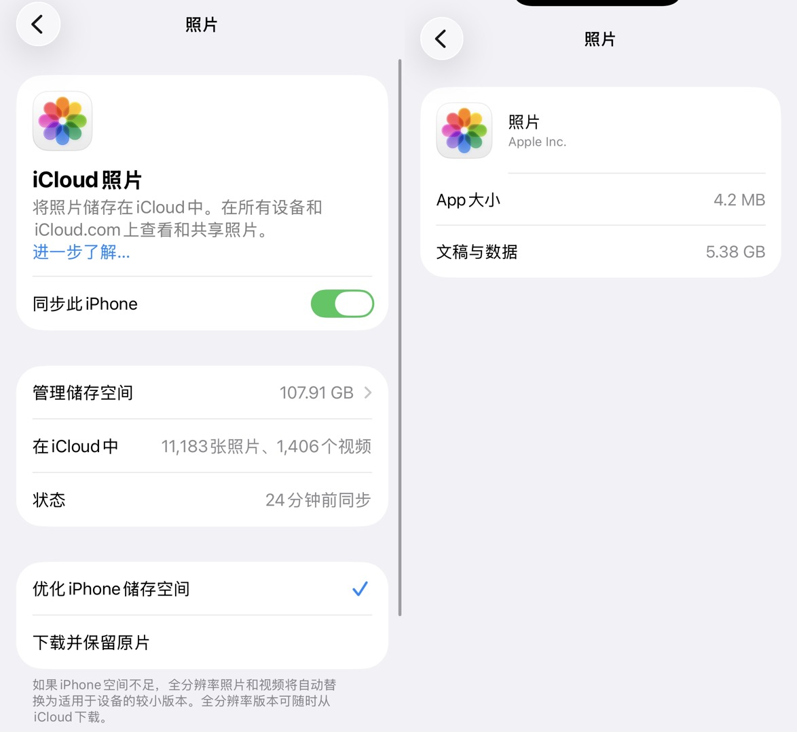

> 互联网时代，数据的稳定存储是十分昂贵的。丢失手机，就会丢失照片和聊天记录。曾经风光一时的天涯论坛关站，无数神贴一夜归零。这警示我们：做好数字人生计划，留存有价值的信息，享受更便捷的数字生活。

## 1.生活云：iCloud——个人&家庭相册，无感知云端

如果苹果用户，iCloud 是无可替代的最佳选择，唯一的缺点就是2TB需要68元/月的价格，相较于百度云、阿里云等比较贵，但是家庭多人使用还是相当划算。iCloud主要特性/优势如下:

（1）丝滑的云端和本地体验：需要注意iCloud不是网盘的概念，而是无感知的云端同步，因此本地删除、云端同步删除，很多人误操作导致数据丢失。有人就会问了，那我手机只有256GB，云端2TB岂不是白费？ 打开“优化iPhone储存空间”的功能，在设备本地将自动替换为小分辨率版本，全分辨率版本可以随时取回。压缩和取回的过程都是无感的。有了整个功能，上万张照片可以安全无虞的储存，并在设备本地查看、分享。无感知云端的特性是百度云等第三方云盘无法实现的。

（2）兼顾个人使用与家庭共享：iCloud相册可以划分为个人相册和共享相册，相册中既可以保存自己的隐私照片，也可以经过手动确认后将照片添加到共享相册。无须通过Airdrop或者微信传输照片，丝滑分享家人的照片且不重复占用存储空间。共享相册可以指定共享的家庭成员范围；共享相册中的照片可以共同编辑、删除等。

（3）跨设备同步的文件云盘：一个丝滑的文件同步盘，可以在多设备之间同步各类文件。非苹果设备例如Windows下载安装iCloud程序后也支持使用。

（4）自动化手机备份：手机全局备份，包括应用软件和缓存，例如微信聊天记录等。手机不怕丢。

（5）更多功能见[APPLE官方文档](https://support.apple.com/zh-cn/guide/icloud/mm203ae070a2/icloud)

## 2. 影音生活：夸克云盘——资源网络资源、无人机拍摄素材

对于非核心的个人数据，我们追求的是“大空间”和“下载速度”。88Vip赠送的夸克网盘会员，还是比较好用。不需要额外开会员，就可以享受到6TB存储空间和高速下载。用于云端储存各类网络资源、比较良心。找夸克资源：通过百度、谷歌、Telegram频道搜索，保存至自己的夸克网盘。PC/电视端下载夸克PC/TV版本，登陆后即可在大屏观看，88VIP赠送的会员可以享受基本的4K流媒体播放。

附Telegram资源频道：https://t.me/Quark_0

夸克网盘搜索：https://pan.funletu.com/

下载夸克TV版：https://pan.quark.cn/ ，下载安装包后通过U盘在电视上安装。

## 3. 个人记录相关——要求云同步、随时可以导出。

拒绝封闭平台，数据必须可导出。你的思想火花是最宝贵的资产，不要将它们锁在可能随时跑路的小众 App 或随时被封号的社交平台里。

（1）轻量速记：使用手机厂商自带的备忘录功能，并打开同步功能，通常会赠送5GB空间。

（2）使用小红书/微博/微信公众号/微信收藏可以作为辅助手段，可能因触发敏感词或平台封禁。

（3）不建议使用各类小厂商制作的日记、笔记软件，其云同步功能通常收费昂贵，且无法导出数据，有倒闭/跑路风险。

（4）进阶：使用[思源笔记](https://b3log.org/siyuan/download.html)等开源平台自行搭建笔记程序，确保数据属于自己、随时可以导出和备份。（需自行购买或搭建 S3 服务）

## 4. 普通用户不建议NAS

除了存储硬件设备的投资成本，还有容灾备份、电费、应急电源的持续投入，如果还需要外网访问，还需要折腾光猫或者中转，速度也不理想。

## 5.隐私建议

（1）数据上云后，隐私是第一要义。从国内厂商来看，使用苹果的iCloud隐私性有较高保障。

（2）使用网盘程序时，分享文件或者照片须设置密码。

（3）无论是什么手机，打开“限制访问相册”的功能，否则理论上APP具备后台读取全部照片的权限。

（4）分享照片注意照片中的元数据 (EXIF)：照片中可能包含了拍摄时间、手机型号、拍摄的经纬度。向陌生人分享照片原图需谨慎（微信发送时会自动清除照片的拍摄时间和地点，好处是默认隐私保护，坏处是不利于向家人分享照片）

## 6.AI小结

用 iCloud 存生活（隐私+无感），用夸克存资源（量大+娱乐），用本地化笔记存思想（自主+安全），这就是现阶段最实用的数字生存法则。