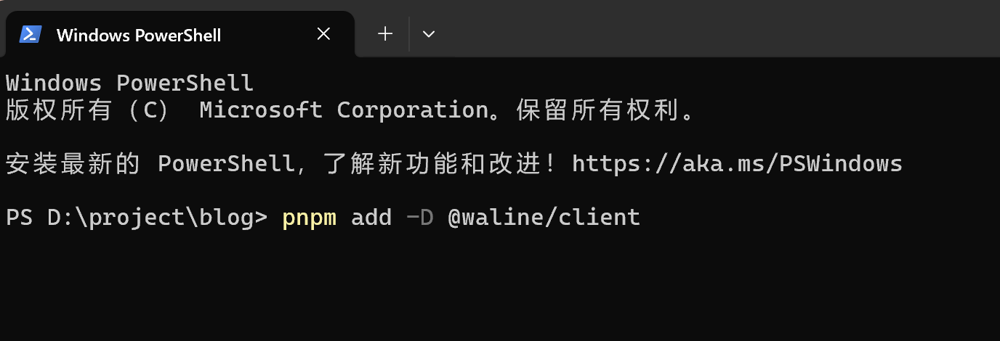
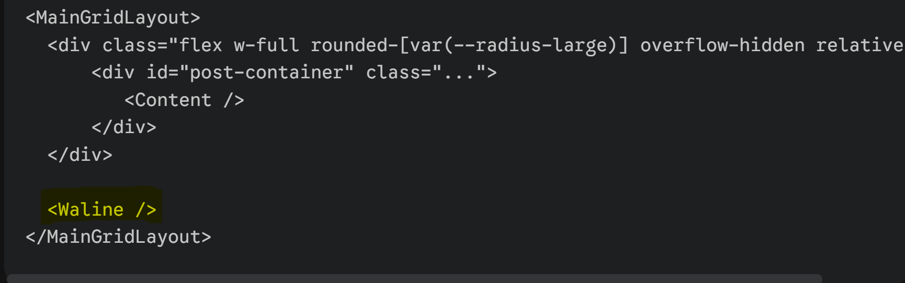

基于Astro的Fuwari主题非常优雅。静态、敏捷，并且页面切换动画非常丝滑、精美。作为博客，评论系统是必备的，经过和Gemini的疯狂对话，整理Fuwari增加Waline评论系统的操作指南如下：

首先要理解Waline的架构：Waline是前端+后端的评论系统，后端需要部署在服务器或者类似于Vercel的云函数；前端需要在博客页面加载。下面分别介绍：

## 安装后端

参照官方文档：[服务端介绍](https://waline.js.org/guide/get-started/server.html)，推荐部署在[Vercel](https://waline.js.org/guide/get-started/)。如果有自己的服务器也可以独立部署。因为官方文档非常详细了，所以不再赘述。

博主使用的`1 Panel`面板，可以在应用商店中一键安装。安装后需要绑定域名并设置SSL。

通过编辑compose 文件，常用的后端环境参数如下：

```
 environment:
  - SQLITE_PATH=SQLITE路径
  - TZ=Asia/Shanghai
  - JWT_TOKEN=登陆密钥
  - COMMENT_AUDIT=false是否开始审核
  - AUTHOR_EMAIL=作者邮箱
  - SITE_NAME=网站名称
  - SITE_URL=网站地址
  - SECURE_DOMAINS=安全地址，配置时安全域名需要同时添加网站地址和 Waline 服务端地址（不包含传输协议，即 http:// 或 https://）。
  - SMTP_SERVICE=SMTP服务商
  - SMTP_USER=SMTP发件人
  - SMTP_PASS=SMTP密码
  - SMTP_SECURE=true
  - DISABLE_REGION=true 隐藏评论者的IP归属地）
  - DISABLE_USERAGENT=true 隐藏评论者的 UA
  - AVATAR_PROXY=https://cravatar.cn/avatar/{{mail|md5}}
  - AKISMET_KEY=false 关闭垃圾检测，海外服务拖慢速度
  - GRAVATAR_STR=https://cravatar.cn/avatar/
            
```

更多环境变量详见官方文档-[服务端环境变量](https://waline.js.org/reference/server/env.html)

完成后端部署后，waline服务地址就是`https://你的waline后端域名`。打开`https://你的waline后端域名/ui/register`进行注册，第一个注册的账号就是博主。

## 加载前端

### 1.将官方客户端导入项目

根据官方文档，Waline 官方客户端已通过 `@waline/client` 发布到 [npm](https://www.npmjs.com/package/@waline/client)，可以通过以下命令安装:

```bash
pnpm add -D @waline/client
```

使用方法：在你的博客根目录下运行上述命令。（可以直接使用Windows自带的命令提示符，右键-在终端中打开）



### 2.创建 Waline 组件

在 `src/components/` 目录下新建一个文件 `Waline.astro`，如果没有编译器，可以直接用记事本打开，粘贴以下内容

```astro
---
// src/components/Waline.astro
import '@waline/client/style';
---

<div class="waline-wrapper mt-8 p-6 rounded-2xl bg-[var(--card-bg)] transition-colors shadow-sm">
  <waline-comments data-server="https://你的-waline-服务端地址"></waline-comments>
</div>

<script>
  import { init } from '@waline/client';

  class WalineComments extends HTMLElement {
    walineInstance = null;

    connectedCallback() {
      const serverURL = this.dataset.server;
      
      // 创建挂载点
      const container = document.createElement('div');
      this.appendChild(container);

      // 初始化 Waline
      this.walineInstance = init({
        el: container,
        serverURL: serverURL,
        // 核心：监听 Fuwari 根元素的 dark 类名，实现黑夜模式的自动切换
        dark: 'html.dark', 
        emoji: [
          'https://unpkg.com/@waline/emojis@1.1.0/bilibili',
        ],
        // 其他你需要的 Waline 配置项...
      });
    }

    disconnectedCallback() {
      // 核心：处理 Swup 页面切换，离开页面时自动销毁实例，防止内存泄漏或重复渲染
      if (this.walineInstance) {
        this.walineInstance.destroy();
      }
    }
  }

  // 注册 Web Component
  if (!customElements.get('waline-comments')) {
    customElements.define('waline-comments', WalineComments);
  }
</script>

<style is:global>
  /* 深度定制 Waline 样式以完美融入 Fuwari */
  :root {
    /* 采用 Fuwari 的主色调 */
    --waline-theme-color: var(--primary);
    --waline-active-color: var(--primary);
    
    /* 基础样式微调 */
    --waline-font-size: 1rem;
    --waline-border-radius: 0.75rem;
  }

  /* 黑夜模式细节优化 */
  html.dark {
    --waline-border: 1px solid var(--line-color, #333);
    /* 让输入框和背景融合到 Fuwari 的深色卡片中 */
    --waline-bgcolor: var(--card-bg, #1e1e1e);
    --waline-bgcolor-light: var(--bg, #121212);
  }
</style>
```


注意将上面的`https://你的-waline-服务端地址`改为你自己的后端地址。

可选配置项（精简化）

```
imageUploader: false, // 关闭图片上传功能（隐藏传图按钮）
search: false,        // 关闭 GIF 搜索功能（隐藏 GIF 按钮）
noRss: true,   //关闭RSS按钮  
        
```

更多教程详见官方文档[《在项目中导入》](https://waline.js.org/cookbook/import/project.html)。

### 3.将组件引入文章页面

接下来，需要把写好的组件注入到博客文章的底部。

找到 Fuwari 渲染文章内容的页面，通常位于 `src/pages/posts/[...slug].astro`。打开该文件，在文章内容的末尾引入并使用 `<Waline />` 组件：




添加到最后即可，如上图。

按照这个方案部署，Waline 就能跟随 Fuwari 的平滑过渡动画完美加载，并且随着右上角的主题按钮实时切换黑夜/白天模式。